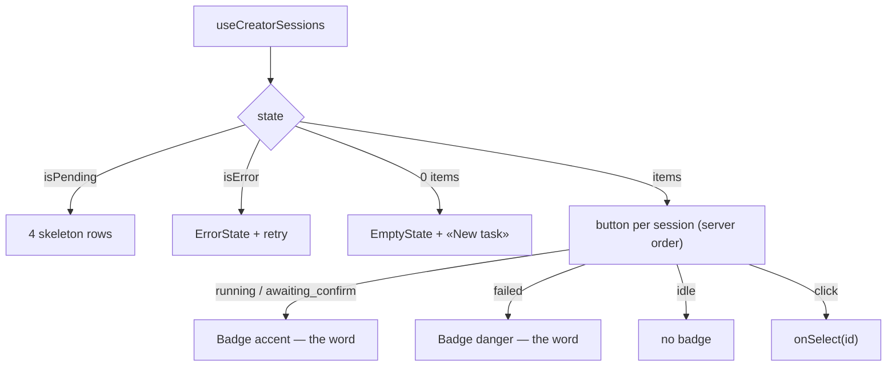

# SessionList.tsx — AI component doc

> AI-facing sidecar for `SessionList.tsx`. Created 2026-07-30. Keep this in sync with the code on every change.

## Purpose
The left rail of `/creator`: every conversation the user has had with the agent, newest first, with a live state word on the ones that still need attention. Owns all four UI states for the list.

## What it does (for an AI reader)
- Responsibilities: fetch the rail; render loading skeletons / error+retry / empty+CTA / rows; mark the open conversation for assistive tech; show a state word for `running`, `awaiting_confirm`, `failed`; report clicks up.
- Public API / exports / props / endpoints: `SessionList(props)`, `type SessionListProps = { activeSessionId: string | null; onSelect: (id: string) => void; onNew: () => void }`. Endpoint reached indirectly: `GET /api/creator/sessions`.
- Inputs → Outputs: the active id → a rail with one row marked current; a row click → `onSelect(id)`; the header/empty-state button → `onNew()`.
- Side effects (I/O, network, state): the `['creator-sessions']` query (shared with `CreatorWorkbench` — one request).

## Dependencies
- Imports / depends on: `react-i18next`, contract type `CreatorSession`, `shared/ui` (`Badge`, `Button`, `EmptyState`, `ErrorState`, `Skeleton`), `../model/api` (`useCreatorSessions`).
- Used by: `CreatorWorkbench.tsx`.

## Diagram

## Key decisions / gotchas
- **Rows are BUTTONS, not `<Link>`s.** A session is not a URL on this screen — `/creator` keeps one address and swaps the active transcript — so a link would promise a destination that does not exist and would break middle-click/open-in-new-tab expectations. (If the selection ever moves into a search param, these become links.)
- **`aria-current="true"` is how the open conversation is announced.** The ridge fill says it only to people who can see it; without the attribute a screen-reader user cannot tell which row is loaded.
- **`idle` prints no badge on purpose.** "ready" on every row of a long rail is noise that hides the one or two rows that actually need attention. The three states that DO print are the ones with news: working, awaiting confirmation, did not finish.
- **The status word is always text** (`Badge` children), never colour alone — design.md §7 / the a11y law. `accent` (amber) for in-progress and gated, `danger` (red) for failed, matching the app-wide status mapping.
- **Order is the server's** (`updated_at DESC`, index `idx_creator_session_user`) and is never re-sorted here; `absorbSessionDetail` upserts rows in place so a running turn does not make the rail jump under the reader.
- **Four states, all present** (CinemaLibrary/CanvasLibrary pattern): the route owns the page canvas, this component owns the list.

## Commits
- _no commit yet_
