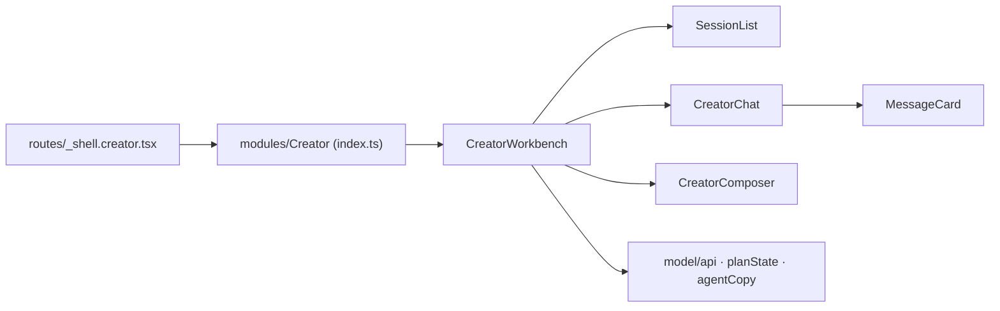

# index.ts — AI component doc

> AI-facing sidecar for `index.ts`. Created 2026-07-30. Keep this in sync with the code on every change.

## Purpose
Public API of the Creator module (openCreator — the `/creator` agent chat). One export: the workbench that composes the whole screen.

## What it does (for an AI reader)
- Responsibilities: expose the module's only public surface and keep everything else internal.
- Public API / exports / props / endpoints: `CreatorWorkbench`. Nothing else.
- Inputs → Outputs: n/a (re-export barrel).
- Side effects (I/O, network, state): none.

## Dependencies
- Imports / depends on: `./components/CreatorWorkbench`.
- Used by: `routes/_shell.creator.tsx`.

## Diagram

## Key decisions / gotchas
- **Exactly one export, deliberately.** The rail, transcript, cards, composer and api layer are internals: publishing them would create an API with no consumer and invite a second screen to assemble the chat differently (two arrangements of the same money button is how a budget gate drifts). Tests import the internal files directly, which is allowed inside the module.
- The module owns its own data layer (`model/api.ts`) and imports no other module — cross-module imports are forbidden, and everything it shares with the rest of the app comes from `shared/`.

## Commits
- _no commit yet_
