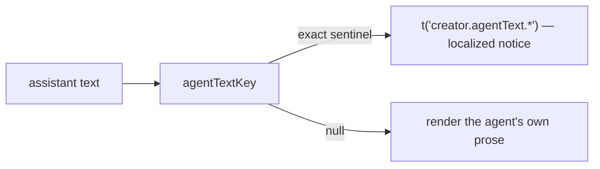

# agentCopy.ts — AI component doc

> AI-facing sidecar for `agentCopy.ts`. Created 2026-07-30. Keep this in sync with the code on every change.

## Purpose
Decides whether an assistant text message is SERVER copy (a sanitized English failure sentence the API writes into the transcript) or the agent's own Russian prose, so the chat never shows an untranslated backend string as user-facing copy.

## What it does (for an AI reader)
- Responsibilities: hold the closed table of the API's three sanitized failure sentences and map each to an i18n key; return `null` for anything else so the agent's own words render verbatim.
- Public API / exports / props / endpoints: `agentTextKey(text: string): string | null`. No endpoints.
- Inputs → Outputs: `'The agent turn failed'` → `'creator.agentText.turnFailed'`; `'Готово, холст собран.'` → `null`.
- Side effects (I/O, network, state): none — pure.

## Dependencies
- Imports / depends on: nothing.
- Used by: `components/MessageCard.tsx` (the text card).

## Diagram

## Key decisions / gotchas
- **The sentinels are duplicated from the API on purpose.** `apps/api/src/modules/creator/brain.ts` (`CreatorUnavailableError`'s two messages) and `service.ts` (`'The agent turn failed'`) produce them; no wire field carries a failure CODE for a transcript message, so exact text is the only join available. If the API ever changes that copy the mapping degrades to pass-through (the English sentence shows) rather than breaking — visible, not silent. A `kind: 'error'` message content carrying a code would be the better long-term fix, and it belongs in the contracts rather than here.
- **Exact match, never `includes`.** A model quoting the phrase inside a longer answer is writing prose; substring matching would replace a healthy turn's answer with a failure notice.
- **Same shape as `shared/libs/errorCopy.ts`** (closed table → i18n keys, safe fallback) but module-local: the strings are openCreator's, not the transport layer's, so `shared/` must not learn them (architecture law: `shared/` has no business logic).

## Commits
- _no commit yet_
