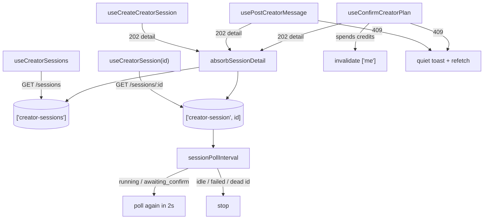

# api.ts — AI component doc

> AI-facing sidecar for `api.ts`. Created 2026-07-30. Keep this in sync with the code on every change.

## Purpose
The Creator module's whole data layer: typed `/api/creator/*` calls, the 2s transcript poll, and the four mutations that drive an agent turn. It exists so the chat components never touch `fetch`, never decide when to poll, and never guess what a `202` means.

## What it does (for an AI reader)
- Responsibilities: fetch the session rail and one session's transcript; decide the poll cadence from the session status; write every `202` answer into the cache instead of refetching; turn a `409` into a quiet toast + a reconciling refetch.
- Public API / exports / props / endpoints: `CREATOR_POLL_INTERVAL_MS` (2000), `sessionPollInterval(state)`, `absorbSessionDetail(queryClient, detail)`, `useCreatorSessions()`, `useCreatorSession(sessionId | null)`, `useCreateCreatorSession()`, `usePostCreatorMessage(sessionId)`, `useConfirmCreatorPlan(sessionId)`, type `SessionPollState`, re-exported types `CreatorSession` / `CreatorSessionDetail`. Endpoints: `GET /api/creator/sessions`, `POST /api/creator/sessions`, `GET /api/creator/sessions/:id`, `POST /api/creator/sessions/:id/messages`, `POST /api/creator/sessions/:id/confirm`.
- Inputs → Outputs: a session id → a polled `CreatorSessionDetail`; a message string → a `202` detail absorbed into `['creator-session', id]` + upserted into `['creator-sessions']`.
- Side effects (I/O, network, state): the five HTTP calls above; `setQueryData` on both creator keys; `invalidateQueries(['me'])` after a confirm (the turn spends credits); `invalidateQueries(['creator-session', id])` after a `409`; one `toast.info` per conflicting click (deduped per session).

## Dependencies
- Imports / depends on: `@tanstack/react-query`, `react-i18next`, contract types (`CreatorSession`, `CreatorSessionDetail`, `CreatorSessionList`), `shared/libs/apiClient` (`api`, `ApiClientError`), `shared/ui` (`toast`).
- Used by: `components/SessionList.tsx`, `components/CreatorChat.tsx`, `components/MessageCard.tsx`, `components/CreatorComposer.tsx`, and (through the module's `index.ts`) `routes/_shell.creator.tsx`.

## Diagram

## Key decisions / gotchas
- **`awaiting_confirm` polls too, and that is deliberate.** The gate can be left WITHOUT this tab acting: a second tab confirms, a new user message resets the budget flag server-side, or the stale reaper fails the turn. A poll that stopped at the gate would leave a live «Подтвердить» button hanging over a plan the server has already retired — the exact failure the stale-plan rendering in `MessageCard` exists to prevent.
- **`sessionPollInterval` is a pure exported function, not an inline lambda.** The rule has three branches (busy → 2s, settled → stop, errored-with-no-data → stop) and each is a real product decision; a lambda inside `refetchInterval` would be untestable and would drift the moment a fourth status appears.
- **A first-load error stops the timer; a transient refetch error does NOT.** `status === 'error' && data === undefined` means the id never answered (deleted/foreign session) — retrying on a timer would hammer a dead id, and the `ErrorState` retry is the way back. But an error with data in hand is one dropped GET mid-turn, and the transcript we hold still says a turn is running, so the loop must recover. Same shape as `Canvas/model/useNodeGeneration`.
- **Mutations absorb, they never invalidate the thing they were just handed.** Every POST answers `202` with the transcript so far; a refetch on success would throw that away and add a round-trip to the one moment the user is watching most closely. `absorbSessionDetail` is the single writer of both caches so the rail and the transcript can never disagree.
- **The rail row is derived from the detail, field by field.** Two caches holding two different ideas of a session is how a list starts showing a stale title; deriving the summary means there is only one source. The row is built with an explicit `CreatorSession` literal rather than by destructuring `messages` off the detail — an explicit pick is checked against the contract, so a field added to the detail later cannot silently leak into the list cache (and the project's ESLint rejects the `_messages` rest-pattern escape anyway). New sessions PREPEND (newest conversation leads), known sessions update IN PLACE — reshuffling the rail under a user mid-turn moves the row they are reading.
- **An unloaded rail is left alone.** `setQueryData` with no `old` returns `old`, so creating a session before the list ever loaded does not fabricate a one-item rail that would flash the wrong count and then be replaced.
- **`409` is a state race, not an error.** The backend returns it when a turn is already running or the plan was already answered — i.e. when the 2s poll had not caught up with the server at the moment of the click. It gets a deduped `toast.info` plus an invalidate that makes the UI agree with the server. Rendering an error screen there would put a failure state over a conversation that is completely healthy.
- **Localization lives in a hook, not in the module scope.** `useTurnErrorHandler` calls `useTranslation()` so the toast copy follows a language switch (the `shotFailureToast` precedent: `t(...)` at the call site, never a raw key into `toast`).

## Commits
- _no commit yet_

## Update 2026-07-30 — background polling (hidden-tab freeze fix)

- `useCreatorSession` now sets `refetchIntervalInBackground: true`. Found live:
  TanStack v5 pauses interval refetches while `document.visibilityState ===
  'hidden'`, and this app globally disables `refetchOnWindowFocus` — together a
  backgrounded transcript froze on «агент работает…» FOREVER (the interval
  callback armed — 4 evaluations returning 2000ms — and never ticked). An agent
  turn runs for minutes and users tab away, so the chat must poll in background.
- Cost bound: `sessionPollInterval` still returns `false` the moment the session
  settles (idle/failed), so a resting chat polls zero.
