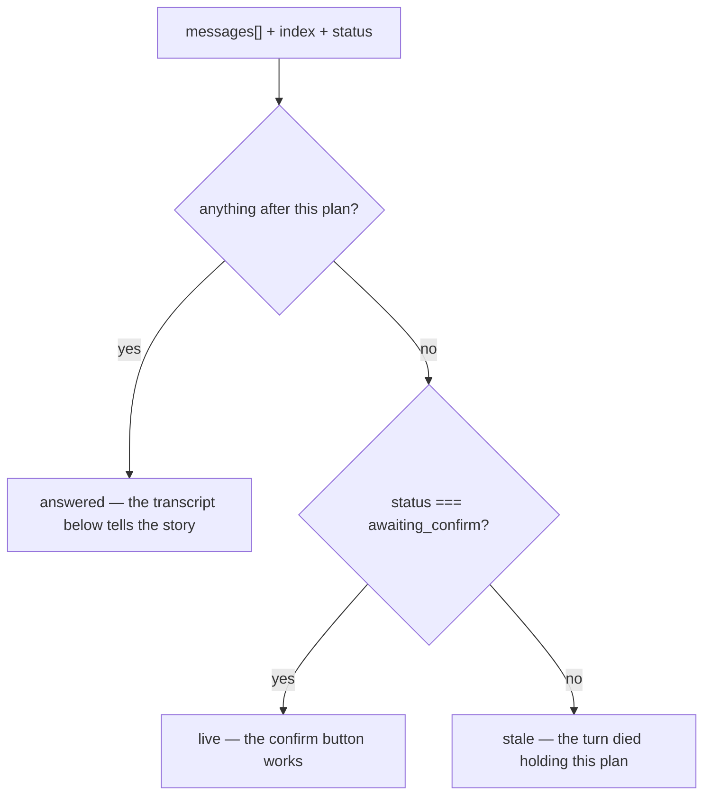

# planState.ts — AI component doc

> AI-facing sidecar for `planState.ts`. Created 2026-07-30. Keep this in sync with the code on every change.

## Purpose
Decides whether a plan card's «Подтвердить · N кр» button is live, historical, or dead. It is the frontend half of the budget gate (ADR opencreator-agent D2), kept pure so the one rule that authorizes spending is tested without a DOM.

## What it does (for an AI reader)
- Responsibilities: classify one plan message against the transcript and the session status into `live` / `answered` / `stale`.
- Public API / exports / props / endpoints: `type PlanState = 'live' | 'answered' | 'stale'`, `planStateFor(messages, index, sessionStatus)`. No endpoints.
- Inputs → Outputs: the message array + this plan's index + `CreatorSessionStatus` → one `PlanState`.
- Side effects (I/O, network, state): none — pure.

## Dependencies
- Imports / depends on: contract types `CreatorMessage`, `CreatorSessionStatus`.
- Used by: `components/CreatorChat.tsx` (computes it per plan message and passes it to `MessageCard`).

## Diagram

## Key decisions / gotchas
- **The card cannot answer this itself, which is the whole reason the function exists.** A plan's own content says nothing about whether it is still the gate: a SECOND plan supersedes the first, and confirming a superseded budget would authorize a total the agent already replaced. Only the chat sees the transcript, so the chat decides and the card renders.
- **`answered` deliberately covers two very different histories** — the server's «Бюджет подтверждён — выполняю план.» line after a confirm, and the user's next message which RESETS the `confirmed` flag server-side. The frontend cannot distinguish them from the wire (a plan message carries no outcome field), so the card makes NO claim in that state; the messages below it are the explanation. Inventing "confirmed" copy here would be a guess shown as a fact.
- **`running` on the newest plan is `stale`, not `live`.** A turn is executing, so the gate is not open; showing a live button would let a second confirm race the running turn (the API answers 409, but the affordance should not offer it in the first place).
- **Array order is the server's order** (`created_at`, `rowid`) and is never re-sorted here — `index < messages.length - 1` is therefore a sound "something came later" test.

## Commits
- _no commit yet_
