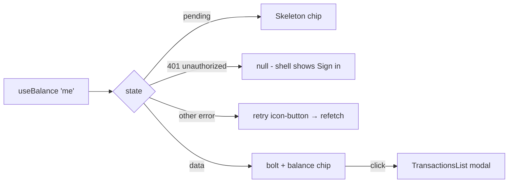

# BalanceChip.tsx — AI component doc

> AI-facing sidecar for `BalanceChip.tsx`. Created 2026-07-06. Keep this in sync with the code on every change.

## Purpose

The header credit-balance chip (bolt + `165`) — the always-visible entry point to
the credit system; clicking it opens the transaction-history modal.

## What it does (for an AI reader)

- Responsibilities: read the balance via `useBalance()` and render the 4 states:
  loading → chip-shaped `Skeleton`; failure → compact retry icon-button; signed out
  (401) → `null`; data → accent chip. Owns the modal's open state.
- Public API / exports / props / endpoints: `BalanceChip` (no props).
- Inputs → Outputs: `['me']` cache → chip with `creditsBalance`; click → mounts
  `TransactionsList` with `isOpen`.
- Side effects (I/O, network, state): GET `/api/me` via `useBalance`; local
  `isHistoryOpen` state.

## Dependencies

- Imports / depends on: `react-i18next`, `shared/libs/apiClient` (`ApiClientError`),
  `shared/ui` (Skeleton), `../model/creditsApi`, `./TransactionsList`.
- Used by: exported through `modules/Credits` index; the AppShell header (plan Task 18).

## Diagram

## Key decisions / gotchas

- `unauthorized` is distinguished from real failures via `instanceof ApiClientError` +
  `code === 'unauthorized'` — signed-out users get NO chip and NO retry noise.
- The retry affordance is a compact icon-button (aria-label `credits.reload`), not a
  full `ErrorState` card — the chip lives in the header and must stay small.
- The bolt is a decorative inline SVG (`aria-hidden`, `currentColor` outline stroke);
  the accessible name comes from `credits.balance`. QA round 1 replaced the previous
  `⚡` emoji: OS emoji render in their own yellow and can't be tinted, which put a
  second accent color into the shell (brief: "exactly one accent color in play").
- Balance updates arrive through the shared `['me']` cache (login invalidation now,
  charge/refund invalidations in Tasks 16-17) — the chip itself never mutates anything.

- v3 stage-3 restyle: the chip is the full AMBER SPECIMEN PILL —
  `bg-specimen-amber/20` + white/10 hairline + `text-lumen-amber` +
  `shadow-pill`, hover `/35` (the exact Button-ghost anatomy), because the
  balance is a real control in the shell and the earlier white/5 caption-chip
  undersold that; the bolt icon wears `text-glow-amber` (the reference's
  amber-pill ICON accent, §2 pill anatomy). Amber = the triad's
  pricing/credits family. The loading skeleton mirrors the pill silhouette
  (`rounded-full`); numeral weight is `font-medium` — the 500 ceiling.
  States, roles and aria-labels untouched.

## Commits

- da1318e 2026-07-06 feat(web): credits balance chip + transactions modal
- cb228e3 2026-07-07 restyle(web): editorial app shell, auth, generator, gallery
- 59cf4f9 2026-07-07 restyle(web): qa round 1 refinements
- 252ab38 2026-07-07 restyle(web): terminal design system — cosmic void tokens, jetbrains mono, specimen pills + docs
