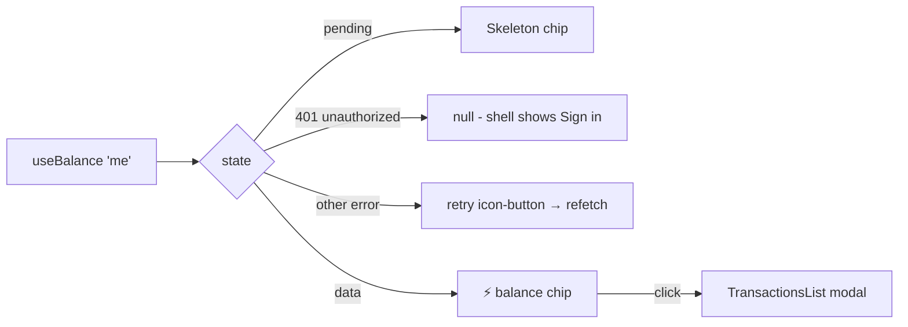

# BalanceChip.tsx — AI component doc

> AI-facing sidecar for `BalanceChip.tsx`. Created 2026-07-06. Keep this in sync with the code on every change.

## Purpose

The header credit-balance chip (`⚡ 165`) — the always-visible entry point to the
credit system; clicking it opens the transaction-history modal.

## What it does (for an AI reader)

- Responsibilities: read the balance via `useBalance()` and render the 4 states:
  loading → chip-shaped `Skeleton`; failure → compact retry icon-button; signed out
  (401) → `null`; data → accent chip. Owns the modal's open state.
- Public API / exports / props / endpoints: `BalanceChip` (no props).
- Inputs → Outputs: `['me']` cache → chip with `creditsBalance`; click → mounts
  `TransactionsList` with `isOpen`.
- Side effects (I/O, network, state): GET `/api/me` via `useBalance`; local
  `isHistoryOpen` state.

## Dependencies

- Imports / depends on: `react-i18next`, `shared/libs/apiClient` (`ApiClientError`),
  `shared/ui` (Skeleton), `../model/creditsApi`, `./TransactionsList`.
- Used by: exported through `modules/Credits` index; the AppShell header (plan Task 18).

## Diagram

## Key decisions / gotchas

- `unauthorized` is distinguished from real failures via `instanceof ApiClientError` +
  `code === 'unauthorized'` — signed-out users get NO chip and NO retry noise.
- The retry affordance is a compact icon-button (aria-label `credits.reload`), not a
  full `ErrorState` card — the chip lives in the header and must stay small.
- The bolt emoji is `aria-hidden`; the accessible name comes from `credits.balance`.
- Balance updates arrive through the shared `['me']` cache (login invalidation now,
  charge/refund invalidations in Tasks 16-17) — the chip itself never mutates anything.

- Stage 3 restyle (2026-07-07): the chip is now the brief's STAMP — `rounded-[3px]`
  hairline vermillion outline (Badge treatment scaled to a 40px hit area) with a
  serif display numeral, replacing the v1 sand-filled pill; the loading skeleton
  mirrors the stamp silhouette. Vermillion lettering on the stamp is the recorded
  design.md §2/§8 exception. States, roles and aria-labels untouched.

## Commits

- da1318e 2026-07-06 feat(web): credits balance chip + transactions modal
