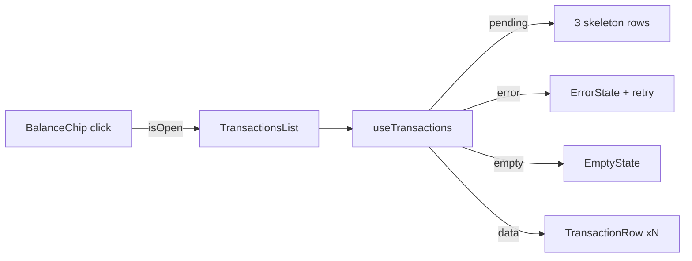

# TransactionsList.tsx — AI component doc

> AI-facing sidecar for `TransactionsList.tsx`. Created 2026-07-06. Keep this in sync with the code on every change.

## Purpose

The credit-history modal opened from `BalanceChip`: last 100 ledger rows with localized
kind labels and signed, colored amounts.

## What it does (for an AI reader)

- Responsibilities: render the 4 UI states inside a `Modal` (skeleton rows / ErrorState
  with retry / EmptyState / rows); format dates per active locale.
- Public API / exports / props / endpoints: `TransactionsList({ isOpen, onClose })`,
  `TransactionsListProps`. Private `TransactionRow` subcomponent.
- Inputs → Outputs: `isOpen` gates the `useTransactions` query → dialog listing
  `credits.kinds.*` labels, `Intl.DateTimeFormat` dates, `+n`/`-n` amounts
  (`text-glow-green` / `text-glow-red`).
- Side effects (I/O, network, state): GET `/api/credits/transactions` while open (via
  `useTransactions`); none while closed.

## Dependencies

- Imports / depends on: `react-i18next`, `@opencreate/contracts` (`CreditTransaction`),
  `shared/ui` (Modal, Skeleton, ErrorState, EmptyState), `../model/creditsApi`.
- Used by: `components/BalanceChip.tsx`; exported through the module `index.ts`.

## Diagram

## Key decisions / gotchas

- The query is `enabled: isOpen` — a closed modal renders nothing AND requests nothing.
- Amount sign is explicit text (`+200` / `-35`); color only reinforces it (a11y rule:
  status is never color-only, design.md §7).
- Dates format with `i18n.language`, so switching EN↔RU re-renders dates correctly.
- Kind labels come from `credits.kinds.<kind>` keys — adding a ledger kind requires new
  locale entries in BOTH en.json and ru.json.

- v3 terminal restyle: the LEDGER rows divide on `divide-white/10` (a read-only
  row must not pretend to be interactive — no hover chips); amounts are mono
  weight-400 numerals in the triad status glows — positive `text-glow-green`
  (succeeded family), negative `text-glow-red`. Tests assert those exact
  classes; sign (+/-) still carries the meaning, never color alone.

## Commits

- da1318e 2026-07-06 feat(web): credits balance chip + transactions modal
- cb228e3 2026-07-07 restyle(web): editorial app shell, auth, generator, gallery
- (pending) restyle(web): terminal design system — cosmic void tokens, jetbrains mono, specimen pills + docs
