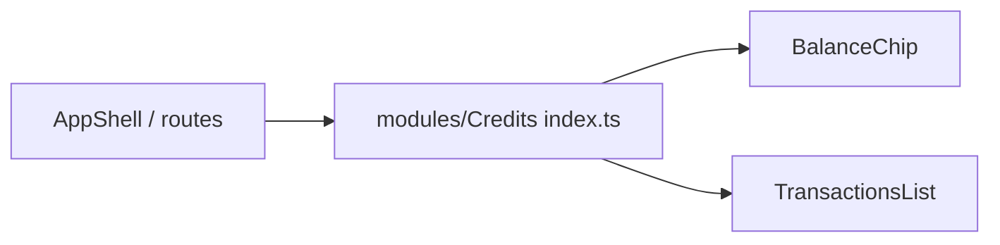

# index.ts — AI component doc

> AI-facing sidecar for `index.ts` (modules/Credits). Created 2026-07-06. Keep this in sync with the code on every change.

## Purpose

Public API of the Credits module — the only import surface other layers may use
(`import { BalanceChip } from 'modules/Credits'`).

## What it does (for an AI reader)

- Responsibilities: re-export the module's public pieces; keep `model/` and
  `components/` internals private (modular-architecture rule).
- Public API / exports / props / endpoints: `BalanceChip`, `TransactionsList`,
  `TransactionsListProps`.
- Inputs → Outputs: barrel only — no logic.
- Side effects (I/O, network, state): none.

## Dependencies

- Imports / depends on: `./components/BalanceChip`, `./components/TransactionsList`.
- Used by: the AppShell header (plan Task 18).

## Diagram

## Key decisions / gotchas

- `creditsApi` hooks are NOT exported: other modules read the balance through the shared
  `['me']` query cache, not by importing Credits internals — modules never import each
  other (cross-module rule).

## Commits

- _no commit yet_
