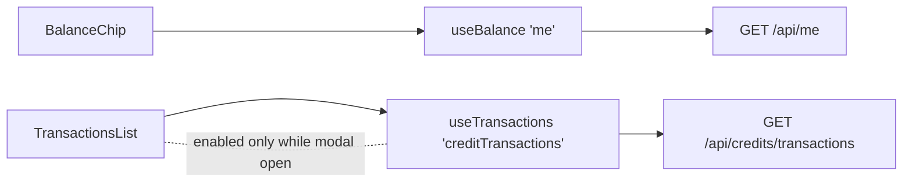

# creditsApi.ts — AI component doc

> AI-facing sidecar for `creditsApi.ts`. Created 2026-07-06. Keep this in sync with the code on every change.

## Purpose

TanStack Query hooks of the Credits module: the ledger-accurate balance (`/api/me`)
and the credit transaction history (`/api/credits/transactions`).

## What it does (for an AI reader)

- Responsibilities: define the module's server-state hooks; no UI.
- Public API / exports / props / endpoints: `useBalance()` → `UseQueryResult<Me>` on key
  `['me']` (staleTime 30s); `useTransactions(isEnabled)` → `UseQueryResult<CreditTransactionList>`
  on key `['creditTransactions']` (enabled-gated, staleTime 0); type `CreditTransactionList`.
- Inputs → Outputs: none → `Me` (balance in `creditsBalance`); `isEnabled` boolean →
  `{ items: CreditTransaction[] }` (last 100, newest first).
- Side effects (I/O, network, state): GETs via `shared/libs/apiClient`; populates the
  shared query cache.

## Dependencies

- Imports / depends on: `@tanstack/react-query`, `@opencreate/contracts`
  (`Me`, `CreditTransaction`), `shared/libs/apiClient`.
- Used by: `components/BalanceChip.tsx` (useBalance), `components/TransactionsList.tsx`
  (useTransactions).

## Diagram

## Key decisions / gotchas

- `['me']` intentionally matches the Auth module's `useMe` key: one cache entry for the
  balance, updated by AuthForm's post-login invalidation and later by the Gallery's
  refund invalidation (Task 17) — modules stay decoupled through the cache.
- History uses `staleTime: 0` + `enabled: isOpen`: fetch on every modal open, never
  while closed (a closed modal must not generate traffic).

## Commits

- da1318e 2026-07-06 feat(web): credits balance chip + transactions modal
