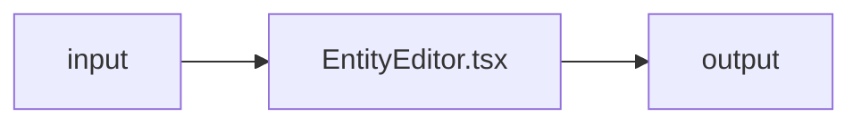

# EntityEditor.tsx — AI component doc

> AI-facing sidecar for `EntityEditor.tsx`. Created 2026-07-09. Keep this in sync with the code on every change.

## Purpose
_What this file/component is and why it exists (one or two sentences)._

## What it does (for an AI reader)
- Responsibilities:
- Public API / exports / props / endpoints:
- Inputs → Outputs:
- Side effects (I/O, network, state):

## Dependencies
- Imports / depends on:
- Used by:

## Diagram

## Key decisions / gotchas
-

## Commits
- _no commit yet_

## Update 2026-07-31 — modal scroller (design.md §6 Modal law)
- The field stack is now `flex min-h-0 flex-1 flex-col gap-4 overflow-y-auto pr-1`, and
  the error + action row moved into a `shrink-0` footer with a hairline.
- In EDIT mode the body carries name + description + preset chips + the photo grid, and
  that grid WRAPS — it grows with every photo added. So the overflow here is not a fixed
  worst case but one the user creates over time, which is exactly why Save is pinned.
- The failure notice moved into the footer with the buttons: it explains why the button
  beside it did nothing, so it must be visible wherever that button is.
