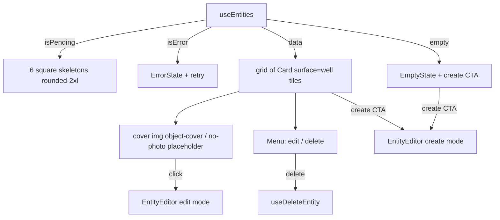

# EntityLibrary.tsx — AI component doc

> AI-facing sidecar for `EntityLibrary.tsx`. Created 2026-07-09. Keep this in sync with the code on every change.

## Purpose

The `/entities` page body: the reusable-subject library (characters, objects,
places) as a 4-state grid of cover-photo tiles, plus the create/edit modal. The
route owns the page canvas; this owns the library.

## What it does (for an AI reader)

- Responsibilities: the 4 UI states over `useEntities` (6 square skeletons →
  `ErrorState` + retry → `EmptyState` + create CTA → tile grid); holding the
  one editor modal in two modes; firing entity deletion.
- Public API / exports: `EntityLibrary` (no props — it owns its own query).
- Inputs → Outputs: the `useEntities` list → a grid of tiles, each a media well
  showing the entity's `primaryImageId` cover (or a quiet "no photo"
  placeholder), its name, its localized kind, and an overflow `Menu`.
- Side effects: `useEntities` (GET), `useDeleteEntity` (DELETE, fired straight
  from the menu item); the editor owns create/update/add-image.

## Dependencies

- Imports: `react` (`useState`), `react-i18next`, `@opencreate/contracts`
  (`Entity`), `shared/ui` (`Button`, `Card`, `EmptyState`, `ErrorState`,
  `Menu`, `Skeleton`), module model (`entitiesApi`), sibling `EntityEditor`.
- Used by: `routes/_shell.entities.tsx` via the `modules/Entities` public API.

## Diagram

## Key decisions / gotchas

- One modal, two modes: `editing === null` while open means CREATE, an entity
  means EDIT. The fields and validation are identical, so forking them would
  only let them drift.
- v4 surface migration (2026-07-09): a tile is `Card surface="well"
  padding="none"`, NOT the default frosted `glass`. An entity's cover photo is
  content — a face the user uploaded must read as a face, not as something
  behind frosted glass. Glass is reserved for chrome that floats OVER media.
- Structural consequence of that: the `<button>` sits INSIDE the Card, because
  a `<button>` takes phrasing content and `Card` renders a `
`. So the
  plate owns the `motion-safe` hover lift and the button owns a
  `focus-visible:ring-inset` ring — an outset ring would be clipped by the
  Card's `overflow-hidden`.
- The skeletons carry the well's `rounded-2xl` radius so the grid does not
  re-corner itself when the real tiles land.
- Deletion fires straight from the menu (no confirm dialog) — unlike a
  generation, an entity costs nothing and its images are re-attachable. If that
  ever changes, use the `gallery.deleteConfirm.*` alertdialog pattern.

## Commits

- b6ab9ec 2026-07-09 feat: CinemaStudio, entity library and shared/ui listbox refactor

## Update 2026-07-31 — the editor is KEYED (it opened blank on existing entities)
- **The bug (from b6ab9ec, found live):** `<EntityEditor entity={editing} …/>` had no
  `key`. The editor seeds its fields with `useState(entity?.name ?? '')` — which runs
  once, at mount — and this component renders it PERMANENTLY (the `Modal` returns null
  while closed, but the component never unmounts). So it mounted on the first render
  with `editing === null` and never re-seeded: pressing "edit" on a real entity showed
  that entity's title and photos over EMPTY name and description fields.
- **It was data loss, not just confusion.** `handleSave` sends `description` as it finds
  it, so a user who typed a name to re-enable the disabled Save button would silently
  overwrite the stored description with `''`.
- **Fix:** `key={editing?.id ?? 'new'}` — the same one-line fix `StyleLibrary` took in
  de5ce6b, and the same reason the Cinema inspector keys on `shot.id`. Keying on the ID
  (not the row) means an unrelated cache update does not remount and discard typing.
- Pinned by `EntityLibrary.test.tsx`: opening edit shows the entity's name AND
  description, and opening a second entity re-seeds. Verified red before the fix.
