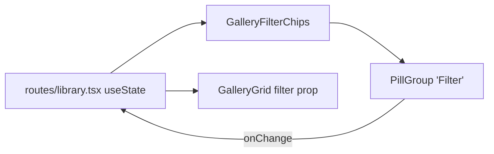

# GalleryFilterChips.tsx — AI component doc

> AI-facing sidecar for `GalleryFilterChips.tsx`. Created 2026-07-06. Keep this in sync with the code on every change.

## Purpose

Type-filter chips of the library page (All / Images / Videos) — a localized
wrapper over the shared `PillGroup`.

## What it does (for an AI reader)

- Responsibilities: present the three `GalleryFilter` options. Controlled; no state.
- Public API / exports: `GalleryFilterChips` with
  `GalleryFilterChipsProps = { value: GalleryFilter, onChange(filter) }`.
- Inputs → Outputs: current filter → `onChange` with the clicked filter.
- Side effects: none.

## Dependencies

- Imports: `react-i18next`, `shared/ui` (`PillGroup`), `./GalleryGrid` (`GalleryFilter` type).
- Used by: `routes/library.tsx` (chips + `useState` composition).

## Diagram

## Key decisions / gotchas

- The selected value lives in the ROUTE (plain `useState`) — it's page-local UI
  state, not module business state; the chips stay a dumb presenter.
- Reuses `PillGroup` instead of a bespoke chip row — the exact reuse case that
  justified promoting it to `shared/ui` (design.md §9).

## Commits

- 9ffc310 2026-07-06 feat(web): gallery with 4-state cards and 4s polling of processing items
