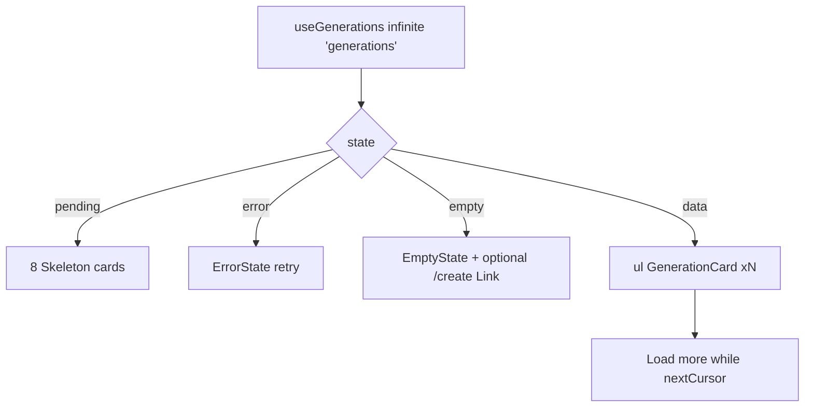

# GalleryGrid.tsx — AI component doc

> AI-facing sidecar for `GalleryGrid.tsx`. Created 2026-07-06. Keep this in sync with the code on every change.

## Purpose

The generations grid — the Gallery module's main surface, implementing the full
4-states rule over the infinite list plus client-side type filtering.

## What it does (for an AI reader)

- Responsibilities: list orchestration only; per-item rendering is `GenerationCard`.
- Public API / exports: `GalleryGrid` with
  `GalleryGridProps = { filter?: GalleryFilter, hasCreateCta?: boolean }`;
  `GalleryFilter = 'all' | 'image' | 'video'`.
- Inputs → Outputs:
  - loading → 8 card-shaped `Skeleton`s (static keys — no index keys).
  - error → `ErrorState` + retry (refetch).
  - empty (after filtering) → `EmptyState`, optional `/create` CTA `Link`.
  - data → `<ul>` of `GenerationCard` + ghost "Load more" while `hasNextPage`.
- Side effects: `useGenerations` infinite query (`['generations']`).

## Dependencies

- Imports: `@tanstack/react-router` (`Link`), `react-i18next`,
  `shared/ui` (`Button`, `EmptyState`, `ErrorState`, `Skeleton`),
  module model (`generationsApi`), sibling `GenerationCard`.
- Used by: `routes/create.tsx` (embedded, `hasCreateCta=false`),
  `routes/library.tsx` (with filter chips) — via `modules/Gallery` public API.

## Diagram

## Key decisions / gotchas

- Filter is CLIENT-side over loaded pages (plan Task 17) — the API has no type
  param in MVP; filtering happens after `flatMap`, so "empty" respects it.
- `hasCreateCta=false` on the create page: a CTA pointing at the page it sits
  on is noise; the EmptyState copy still explains what will appear.
- "Load more" is an explicit button (not scroll-triggered): the grid also lives
  beside the Generator form where an auto-loader would fight the page scroll.
- The CTA `Link` is styled with the primary Button classes (NotFoundPage
  convention) — semantically navigation, visually the main action. v3: the
  GREEN specimen pill, because creating is THE green action in the triad.
- Skeletons are the shared Skeleton's stepped surface pulse
  (`animate-skeleton bg-steel`) — exactly 8 nodes (the test counts
  `.animate-skeleton`). v4: they carry `rounded-2xl`, the radius of the `well`
  Card the media lands in, so the whole grid does not re-corner itself the
  moment data arrives.

## Commits

- 9ffc310 2026-07-06 feat(web): gallery with 4-state cards and 4s polling of processing items
- cb228e3 2026-07-07 restyle(web): editorial app shell, auth, generator, gallery
- 252ab38 2026-07-07 restyle(web): terminal design system — cosmic void tokens, jetbrains mono, specimen pills + docs

## Update 2026-08-02 — `models` pass-through

- New optional prop `models: GalleryModelOption[]` (the same id→name list the filter bar
  takes). The grid does nothing with it: it hands it to every card and row so the detail
  viewer can NAME the model. Gallery still never reads the Generator's catalog query — the
  ROUTE is the seam, as it already was for the filter bar and `onRegenerate`.
- The two optional pass-throughs are now spread from ONE `passThrough` object, because
  `exactOptionalPropertyTypes` makes `prop={undefined}` different from an absent prop and
  three call sites repeating two conditional spreads is where that drifts.
