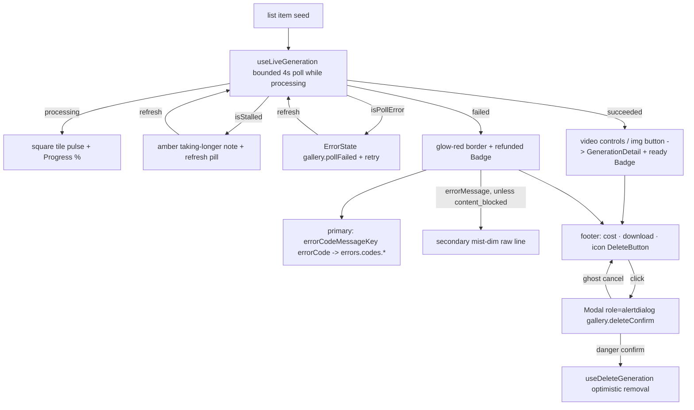

# GenerationCard.tsx — AI component doc

> AI-facing sidecar for `GenerationCard.tsx`. Created 2026-07-06. Keep this in sync with the code on every change.

## Purpose

One generation in the gallery grid as a FIGURE (v3 terminal, stage 3: SQUARE
abyss media tile at 8px radius + quiet mono prompt caption + white/10 hairline
meta row — no card wrapper), covering the three per-item states in the status
triad (processing=amber, succeeded=green, failed=red): processing (progress +
amber percent, with the stalled amber note + manual refresh past the 20-minute
polling budget, and an ErrorState + retry when the status poll itself fails),
succeeded (playable/enlargeable media + green "ready" chip +
actions), failed (glow-red hairline tile + reason + refunded chip). Delete is
a glow-red icon button that opens a blocking confirmation alertdialog — the
paid generation is only removed after an explicit confirm.

## What it does (for an AI reader)

- Responsibilities: render the live state of one generation; own the detail
  modal open/close; own the delete-confirmation dialog open/close; trigger
  delete only after confirm. Keeps itself live via `useLiveGeneration`.
- Public API / exports: `GenerationCard` with `GenerationCardProps = { generation: Generation }`
  (the list-cache item as seed).
- Inputs → Outputs:
  - processing → `animate-skeleton` SQUARE abyss tile (the stepped surface
    pulse) + `Progress` + glow-amber "n%" numeral, NO `<video>`.
    - stalled (`isStalled`, 20 min past `createdAt`) → adds a `role="status"`
      row: glow-amber `gallery.stalled` note + amber ghost `gallery.refresh`
      pill running ONE manual poll (`refresh`, spinner via `isRefreshing`).
    - poll failure (`isPollError`) → replaces the tile with
      `ErrorState message=gallery.pollFailed onRetry=refresh` — the card never
      freezes at "Generating N%".
  - succeeded video → `<video controls src>` letterboxed on the square abyss
    tile; image → media button (lift hover, motion-safe, `object-cover` crop)
    opening `GenerationDetail`; green "ready" `Badge`; hairline footer: cost +
    portal download link + glow-red icon delete.
  - failed → glow-red-HAIRLINE square abyss tile (`border-glow-red`), stored
    failure reason, success-variant "Credits refunded" chip, delete.
- Side effects: polling + invalidations via `useLiveGeneration`; DELETE via
  `useDeleteGeneration` — fired exclusively from the confirmation dialog's
  danger pill (`gallery.deleteConfirm.confirm`).

## Dependencies

- Imports: `react` (`useState`), `react-i18next`, `@opencreate/contracts`,
  `shared/ui` (`Badge`, `Button`, `ErrorState`, `Modal`, `Progress`),
  `shared/libs/errorCopy` (`errorCodeMessageKey`), module model
  (`generationsApi`), sibling `GenerationDetail`.
- Used by: `components/GalleryGrid.tsx`.

## Diagram

## Key decisions / gotchas

- Stage-3: media wells are SQUARE tiles (`aspect-square`, 8px radius) — the
  same tile language as the landing's specimen grid, so the library reads as
  one product with the landing; images crop with `object-cover`, videos
  letterbox on the abyss plate, and the full frame lives in `GenerationDetail`.
  The fixed square keeps CLS at zero across all states (the earlier
  real-aspect `aspectClasses` map is gone with the uniform tile).
- Failed cards (QA finding 3): the PRIMARY reason line is always OUR copy —
  `t(errorCodeMessageKey(errorCode))` from `shared/libs/errorCopy`
  (`errors.codes.*`; unknown/missing code → generic). The stored raw
  `errorMessage` may follow only as the secondary `text-mist-dim` caption —
  the deliberate, recorded exception to design.md §9's "no raw server text".
- EXCEPT safety blocks: when `errorCode === 'content_blocked'` the raw provider
  message is suppressed entirely — moderation strings are never user copy
  (review decision 2026-07-07); the localized primary still explains the block.
- Status is never color-only (a11y §7): glow-red border + "Generation failed"
  text + refunded chip all carry it together.
- ADDED 2026-07-07 (QA findings 1-2): the stalled sub-state stays AMBER (still
  processing — red would claim a failure that has not happened) and keeps the
  Progress row visible; the poll-error sub-state REPLACES the tile with the
  shared `ErrorState` (calm hairline frame + amber ghost retry) because with a
  dead status feed the "Generating N%" number would be a lie.
- Delete is offered only for terminal states — a processing task can't be
  cancelled in the MVP API.
- v3 terminal restyle intent: media plates moved to `bg-abyss rounded-lg` (the
  recessed surface step reserved for user media); the processing well now runs
  `animate-skeleton` — the SAME stepped surface pulse as Skeleton, because a
  loading well IS a skeleton (tests query `.animate-skeleton`); the percent
  numeral wears glow-AMBER (processing status color, weight 400); download is a
  portal-blue link (prose-link law). Tests updated: `.border-danger` →
  `.border-glow-red`. Behavior, roles and i18n untouched.
- Stage-3 status & delete: succeeded gained the green "ready" `Badge`
  (`gallery.ready`) so all three triad states are SAID in text, not implied by
  media presence; delete moved from the red specimen pill to a quiet glow-red
  ICON button (`DeleteButton`) — design.md §2 files `#ff2056` under
  "icons/status only", and a red pill on every figure shouted destructiveness
  across the grid. The `aria-label` keeps the exact accessible name
  (`gallery.delete`), 40px hit area, spinner + `aria-busy` while pending.
- FIXED 2026-07-07 (review finding): delete previously destroyed a PAID
  generation in one click — the optimistic cache removal + media deletion ran
  straight from the icon. The icon now only opens a blocking confirmation
  (`Modal role="alertdialog"`, `gallery.deleteConfirm.*` EN/RU): one quiet
  mist sentence states the permanence, the DANGER specimen pill confirms, the
  GHOST pill cancels. `useDeleteGeneration.mutate` (and thus the optimistic
  removal) fires only on confirm; the dialog closes first so the card's
  disappearance reads as the immediate result of the confirm click.

## Commits

- 9ffc310 2026-07-06 feat(web): gallery with 4-state cards and 4s polling of processing items
- 3b96d8c fix(api,web,contracts): respect the NSFW flag — content_blocked failure with refund, never store flagged assets, localized safety copy
- cb228e3 2026-07-07 restyle(web): editorial app shell, auth, generator, gallery
- 252ab38 2026-07-07 restyle(web): terminal design system — cosmic void tokens, jetbrains mono, specimen pills + docs
- e5888a4 2026-07-07 restyle(web): terminal app shell, auth, generator, gallery, credits
- dd795f7 2026-07-07 fix(web): delete confirmation dialog for generations
