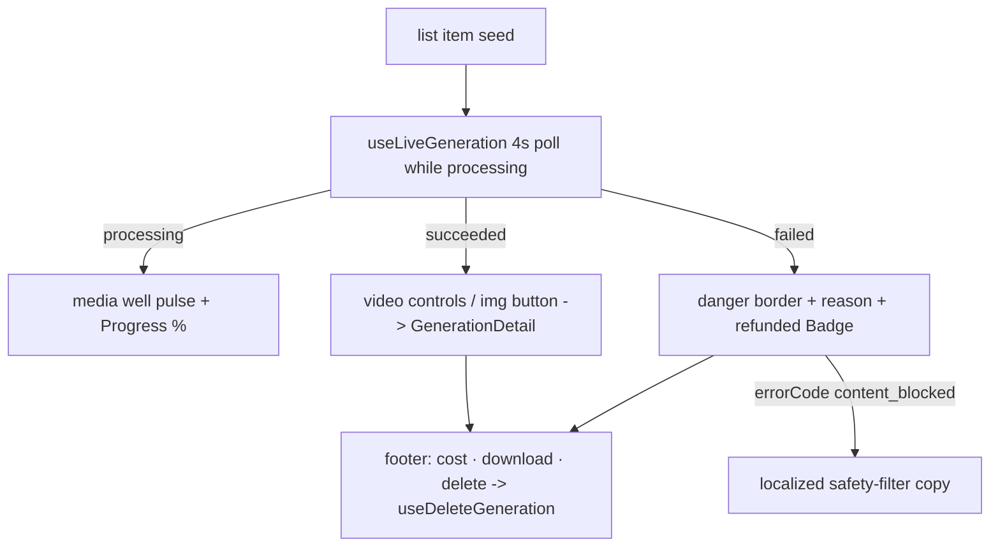

# GenerationCard.tsx — AI component doc

> AI-facing sidecar for `GenerationCard.tsx`. Created 2026-07-06. Keep this in sync with the code on every change.

## Purpose

One generation in the gallery grid as a magazine FIGURE (stage-3 redesign: dark
media plate + serif-italic prompt caption on cream + hairline meta row — the white
card is retired), covering the three per-item states: processing (progress + serif
percent), succeeded (playable/enlargeable media + actions), failed (danger-hairline
well + reason + refunded stamp).

## What it does (for an AI reader)

- Responsibilities: render the live state of one generation; own the detail
  modal open/close; trigger delete. Keeps itself live via `useLiveGeneration`.
- Public API / exports: `GenerationCard` with `GenerationCardProps = { generation: Generation }`
  (the list-cache item as seed).
- Inputs → Outputs:
  - processing → pulsing `bg-media` well (real aspect) + `Progress` + serif "n%"
    numeral, NO `<video>`.
  - succeeded video → `<video controls src>` on the media well; image → media
    button (print-lift hover, motion-safe) opening `GenerationDetail`; hairline
    footer: cost + underline download link + ghost delete.
  - failed → danger-HAIRLINE media well (`border-danger` on the well, quiet
    `bg-ink/5` fill), stored failure reason, success-variant "Credits refunded"
    stamp badge, delete.
- Side effects: polling + invalidations via `useLiveGeneration`; DELETE via `useDeleteGeneration`.

## Dependencies

- Imports: `react` (`useState`), `react-i18next`, `@opencreate/contracts`,
  `shared/ui` (`Badge`, `Button`, `Progress`), module model (`generationsApi`),
  sibling `GenerationDetail`.
- Used by: `components/GalleryGrid.tsx`.

## Diagram

## Key decisions / gotchas

- Media wells use the generation's REAL aspect ratio (`aspectClasses` literal
  map — Tailwind cannot see computed class names) so nothing jumps when the
  asset arrives (CLS budget, design.md §4).
- Failed cards show the stored `errorMessage` as a secondary caption per the
  plan's card contract — a deliberate, recorded exception to design.md §8's
  "no raw server text" (the primary line stays localized).
- EXCEPT safety blocks: when `errorCode === 'content_blocked'` the card renders
  the localized `gallery.contentBlocked` copy instead of the raw provider
  message — moderation failures are user-facing product copy, never provider text.
- Status is never color-only (a11y §7): danger border + "Generation failed"
  text + refunded badge all carry it together.
- Delete is offered only for terminal states — a processing task can't be
  cancelled in the MVP API.
- Stage 3 restyle (2026-07-07): white card wrapper retired — the figure sits
  directly on cream (media plate `rounded-sm bg-media`, prompt = serif-italic
  figure caption, meta/actions over a `border-ink/10` hairline). The failed
  state's `border-danger` moved from the card wrapper to the media well itself
  (tests query the class, not its host). Download became the ink/hairline-underline
  text action (small vermillion text breaks §2 contrast policy). Percent numeral is
  serif display per the brief. Behavior, roles and i18n untouched.

## Commits

- 9ffc310 2026-07-06 feat(web): gallery with 4-state cards and 4s polling of processing items
- 3b96d8c fix(api,web,contracts): respect the NSFW flag — content_blocked failure with refund, never store flagged assets, localized safety copy
- cb228e3 2026-07-07 restyle(web): editorial app shell, auth, generator, gallery
