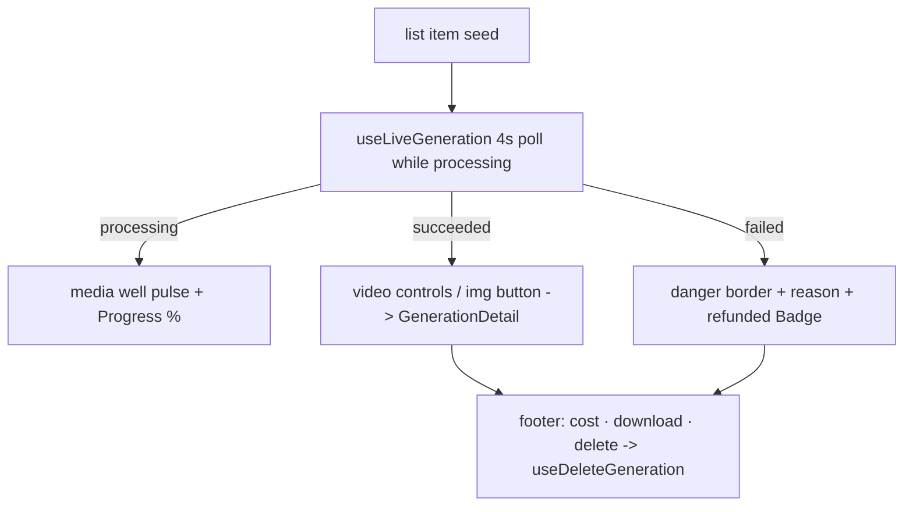

# GenerationCard.tsx — AI component doc

> AI-facing sidecar for `GenerationCard.tsx`. Created 2026-07-06. Keep this in sync with the code on every change.

## Purpose

One generation in the gallery grid, covering the three per-item states:
processing (progress), succeeded (playable/enlargeable media + actions),
failed (reason + refunded badge).

## What it does (for an AI reader)

- Responsibilities: render the live state of one generation; own the detail
  modal open/close; trigger delete. Keeps itself live via `useLiveGeneration`.
- Public API / exports: `GenerationCard` with `GenerationCardProps = { generation: Generation }`
  (the list-cache item as seed).
- Inputs → Outputs:
  - processing → pulsing `bg-media` well (real aspect) + `Progress` + "n%" caption, NO `<video>`.
  - succeeded video → `<video controls src>` on the media well; image → media
    button opening `GenerationDetail`; footer: cost + download link + delete.
  - failed → `border-danger` card, localized "Generation failed" well, stored
    failure reason, success-variant "Credits refunded" badge, delete.
- Side effects: polling + invalidations via `useLiveGeneration`; DELETE via `useDeleteGeneration`.

## Dependencies

- Imports: `react` (`useState`), `react-i18next`, `@opencreate/contracts`,
  `shared/ui` (`Badge`, `Button`, `Progress`), module model (`generationsApi`),
  sibling `GenerationDetail`.
- Used by: `components/GalleryGrid.tsx`.

## Diagram

## Key decisions / gotchas

- Media wells use the generation's REAL aspect ratio (`aspectClasses` literal
  map — Tailwind cannot see computed class names) so nothing jumps when the
  asset arrives (CLS budget, design.md §4).
- Failed cards show the stored `errorMessage` as a secondary caption per the
  plan's card contract — a deliberate, recorded exception to design.md §8's
  "no raw server text" (the primary line stays localized).
- Status is never color-only (a11y §7): danger border + "Generation failed"
  text + refunded badge all carry it together.
- Delete is offered only for terminal states — a processing task can't be
  cancelled in the MVP API.

## Commits

- 9ffc310 2026-07-06 feat(web): gallery with 4-state cards and 4s polling of processing items
