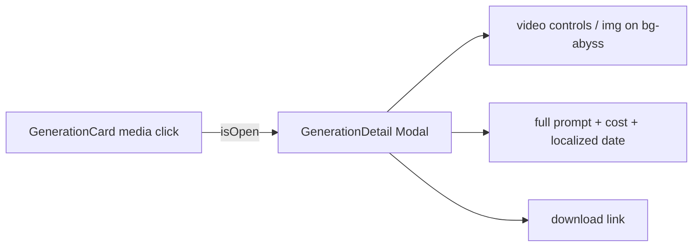

# GenerationDetail.tsx — AI component doc

> AI-facing sidecar for `GenerationDetail.tsx`. Created 2026-07-06. Keep this in sync with the code on every change.

## Purpose

Detail modal for a succeeded generation: full-size media, complete prompt,
cost + locale-formatted date, and a download action.

## What it does (for an AI reader)

- Responsibilities: present one generation inside the shared `Modal`. Controlled; no fetching.
- Public API / exports: `GenerationDetail` with
  `GenerationDetailProps = { generation: Generation, isOpen: boolean, onClose(): void }`.
- Inputs → Outputs: a `Generation` DTO → `<video controls>` or `` + prompt + meta + download link.
- Side effects: none.

## Dependencies

- Imports: `react-i18next`, `@opencreate/contracts` (`Generation`), `shared/ui`
  (`Card`, `Modal`, `MenuItem`), sibling `useGenerationActions`.
- Used by: `components/GenerationCard.tsx` (opened from the image media button)
  and `components/GenerationRow.tsx` (the table view's thumbnail).

## Diagram

## Key decisions / gotchas

- Callers only open it for SUCCEEDED items (processing/failed cards have no
  media worth enlarging) — the null-media guard is defensive, not a state.
- Date via `Intl.DateTimeFormat(i18n.language)` — follows the app locale, not
  the browser's (same convention as Credits' TransactionsList).
- Uses the shared `Modal` (`role="dialog"`): Escape/overlay close, scroll lock,
  focus restore come for free.
- v4 surface migration (2026-07-09): the media plate is
  `Card surface="well" padding="none"` inside a `Modal surface="glass"` sheet —
  one surface step BELOW the sheet, so the frosted dialog floats and the user's
  work is sunk into it. Everything passed through the Card's `className` there
  is layout (`flex`, `max-h-[70dvh]`, centering, `overflow-hidden`); the
  surface itself is Card's to own. Behavior, a11y and i18n untouched.
- The media box is height-capped and the image is `object-contain`: a 9:16
  portrait used to render taller than the viewport with no scroll, cutting its
  own bottom off. This view exists to show the full frame the card crops.

## Commits

- 9ffc310 2026-07-06 feat(web): gallery with 4-state cards and 4s polling of processing items
- cb228e3 2026-07-07 restyle(web): editorial app shell, auth, generator, gallery
- 252ab38 2026-07-07 restyle(web): terminal design system — cosmic void tokens, jetbrains mono, specimen pills + docs

## Update 2026-07-31 — modal scroller (design.md §6 Modal law)
- The body already carried `min-h-0`; this adds the `overflow-y-auto` that completes the
  pair. One word, and it was the missing half.
- The MEDIA was never the risk — `max-h-[70dvh]` shrinks it with the viewport. The PROMPT
  is: contracts allow 2000 characters, which wraps to more height than the panel has left,
  pushing the action rail past the bottom while the wheel scrolls the page behind the
  overlay.
- The actions scroll WITH the content rather than being pinned: this is a read-mostly
  detail sheet (the Templates canon), and its icon rail is a set of options, not the one
  outcome the sheet exists for.

## Update 2026-08-02 — v2: the FULL-SCREEN viewer (media stage + information column)

- `Modal size="full"` (new kit size: `h-[92dvh] max-w-[96rem]`). Layout is a grid, not a
  stack: at ≥lg `minmax(0,1fr) 22rem` — the media stage takes the room, the information
  column is a fixed 22rem of text beside it and owns its OWN scroller. Below lg the two
  stack and the whole body scrolls (a 380px split is two unusable columns).
- The information column, in reading order: a `gallery.detail.info` caption + the green
  "ready" `Badge`, the ⋯ `Menu`, the PROMPT in its own `well` plate (the one long-form
  field, `break-words` for pasted URLs), then a `<dl>` of six facts —
  **model** (named from the injected catalog, `modelId` as the fallback), type, aspect,
  duration, cost, created. `tabular-nums`, since most values are numerals.
- Actions: the shared list, wrapped one level so this view can add "…and then close the
  sheet" for `regenerate` without the action set learning that a viewer exists. NO icon
  rail — Delete is irreversible and was sitting at Download's weight under the media
  (design.md §13.2: destructive/secondary actions belong in an overflow).
- The video keeps `controls` HERE (plus `autoPlay` — opening the sheet took a click, which
  is the user activation the autoplay policies ask for). That is the point of the poster
  plate in the grid: playing a clip means opening this view.
- New optional prop `models: GalleryModelOption[]` — injected by the ROUTE (`/create` and
  `/library` both read `useCatalog`), because Gallery may not import the Generator's
  catalog query. Absent, or a retired model → the raw id, which is still the honest answer
  to "what made this".
- `pr-12` on the column's header row clears the sheet's floating close button.

## Update 2026-08-02 (same day, owner: "вёрстка кривая, кнопка крестик") — the chrome cluster

- MEASURED in the running app at 1336×839: the ⋯ (in the column's header row) ended at
  x=1255 and the sheet's ✕ started at x=1255 — **zero gap** — and their tops differed by
  4px (54 vs 58). Two identical 40px circles glued together and misaligned.
- Fix: the ⋯ left the column and became sheet CHROME — `absolute top-6 right-[4.5rem]`
  on the (relative) panel, the same `top-6` the Modal's own close button uses. 24 + 40 =
  64px is where the ✕ ends, so 4.5rem (72px) is the first offset that clears it by the
  §13.1 8px minimum. Both now sit at y=58 with an 8px gap: one cluster, not two strays.
  Being outside the column also means the chrome does not scroll away with the text.
- The column's header row keeps `lg:pr-28` so the caption/badge never slide under that
  cluster; on the stacked layout the cluster is over the MEDIA, so the clearance is
  bought only at ≥lg. Column gutters became `lg:pt-6 lg:pr-3 lg:pl-1` — the text had been
  sitting 16px from the sheet edge with the same padding all round.
- `Создано` spans both `<dl>` columns: "31 июл. 2026 г., 17:25" wrapped mid-date in a
  160px half-column.
- Verified by geometry, not by eye: dialog 1304×772 inside 1336×839, stage 915 + gap 12 +
  column 352 = 1279 grid, `scrollWidth === clientWidth` on every box (no overflow).
