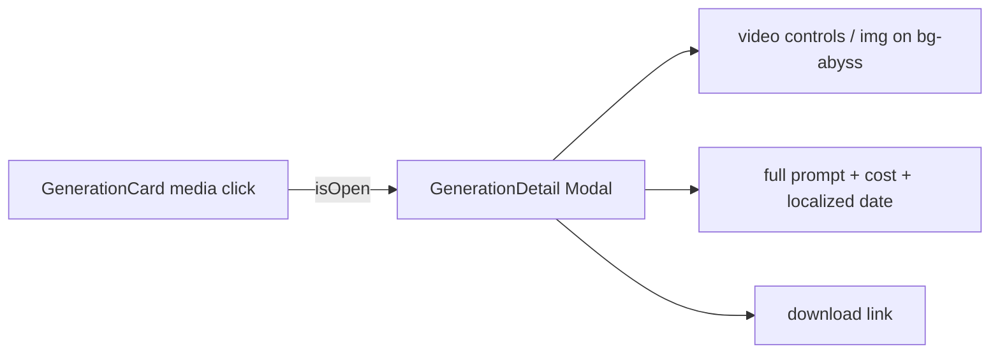

# GenerationDetail.tsx — AI component doc

> AI-facing sidecar for `GenerationDetail.tsx`. Created 2026-07-06. Keep this in sync with the code on every change.

## Purpose

Detail modal for a succeeded generation: full-size media, complete prompt,
cost + locale-formatted date, and a download action.

## What it does (for an AI reader)

- Responsibilities: present one generation inside the shared `Modal`. Controlled; no fetching.
- Public API / exports: `GenerationDetail` with
  `GenerationDetailProps = { generation: Generation, isOpen: boolean, onClose(): void }`.
- Inputs → Outputs: a `Generation` DTO → `<video controls>` or `` + prompt + meta + download link.
- Side effects: none.

## Dependencies

- Imports: `react-i18next`, `@opencreate/contracts` (`Generation`), `shared/ui`
  (`Card`, `Modal`, `MenuItem`), sibling `useGenerationActions`.
- Used by: `components/GenerationCard.tsx` (opened from the image media button)
  and `components/GenerationRow.tsx` (the table view's thumbnail).

## Diagram

## Key decisions / gotchas

- Callers only open it for SUCCEEDED items (processing/failed cards have no
  media worth enlarging) — the null-media guard is defensive, not a state.
- Date via `Intl.DateTimeFormat(i18n.language)` — follows the app locale, not
  the browser's (same convention as Credits' TransactionsList).
- Uses the shared `Modal` (`role="dialog"`): Escape/overlay close, scroll lock,
  focus restore come for free.
- v4 surface migration (2026-07-09): the media plate is
  `Card surface="well" padding="none"` inside a `Modal surface="glass"` sheet —
  one surface step BELOW the sheet, so the frosted dialog floats and the user's
  work is sunk into it. Everything passed through the Card's `className` there
  is layout (`flex`, `max-h-[70dvh]`, centering, `overflow-hidden`); the
  surface itself is Card's to own. Behavior, a11y and i18n untouched.
- The media box is height-capped and the image is `object-contain`: a 9:16
  portrait used to render taller than the viewport with no scroll, cutting its
  own bottom off. This view exists to show the full frame the card crops.

## Commits

- 9ffc310 2026-07-06 feat(web): gallery with 4-state cards and 4s polling of processing items
- cb228e3 2026-07-07 restyle(web): editorial app shell, auth, generator, gallery
- 252ab38 2026-07-07 restyle(web): terminal design system — cosmic void tokens, jetbrains mono, specimen pills + docs
