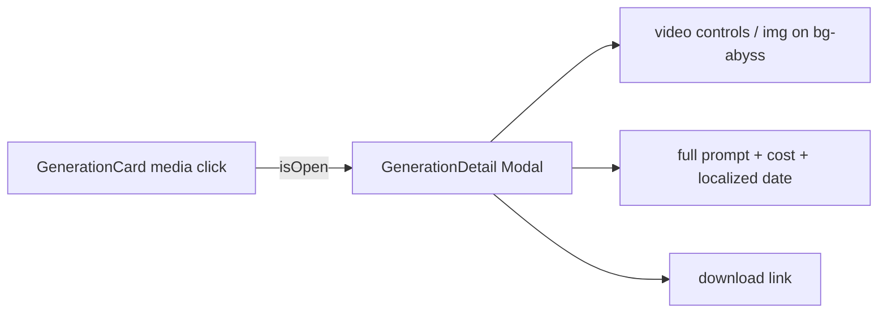

# GenerationDetail.tsx — AI component doc

> AI-facing sidecar for `GenerationDetail.tsx`. Created 2026-07-06. Keep this in sync with the code on every change.

## Purpose

Detail modal for a succeeded generation: full-size media, complete prompt,
cost + locale-formatted date, and a download action.

## What it does (for an AI reader)

- Responsibilities: present one generation inside the shared `Modal`. Controlled; no fetching.
- Public API / exports: `GenerationDetail` with
  `GenerationDetailProps = { generation: Generation, isOpen: boolean, onClose(): void }`.
- Inputs → Outputs: a `Generation` DTO → `<video controls>` or `` + prompt + meta + download link.
- Side effects: none.

## Dependencies

- Imports: `react-i18next`, `@opencreate/contracts` (`Generation`), `shared/ui` (`Modal`).
- Used by: `components/GenerationCard.tsx` (opened from the image media button).

## Diagram

## Key decisions / gotchas

- Callers only open it for SUCCEEDED items (processing/failed cards have no
  media worth enlarging) — the null-media guard is defensive, not a state.
- Date via `Intl.DateTimeFormat(i18n.language)` — follows the app locale, not
  the browser's (same convention as Credits' TransactionsList).
- Uses the shared `Modal` (`role="dialog"`): Escape/overlay close, scroll lock,
  focus restore come for free.
- v3 terminal restyle: media plate `rounded-lg bg-abyss` — one surface step
  BELOW the modal's steel sheet so the user's work reads as recessed film; the
  prompt is the quiet mono mist caption (same voice as GenerationCard);
  download is a portal-blue link (the sanctioned prose-link color, v3 §2).
  Behavior and i18n untouched.

## Commits

- 9ffc310 2026-07-06 feat(web): gallery with 4-state cards and 4s polling of processing items
- cb228e3 2026-07-07 restyle(web): editorial app shell, auth, generator, gallery
- (pending) restyle(web): terminal design system — cosmic void tokens, jetbrains mono, specimen pills + docs
