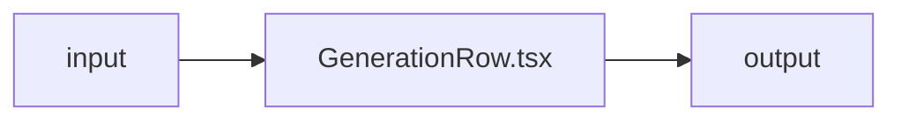

# GenerationRow.tsx — AI component doc

> AI-facing sidecar for `GenerationRow.tsx`. Created 2026-07-08. Keep this in sync with the code on every change.

## Purpose
_What this file/component is and why it exists (one or two sentences)._

## What it does (for an AI reader)
- Responsibilities:
- Public API / exports / props / endpoints:
- Inputs → Outputs:
- Side effects (I/O, network, state):

## Dependencies
- Imports / depends on:
- Used by:

## Diagram

## Key decisions / gotchas
-

## Commits
- _no commit yet_

## Update 2026-08-02 — `models` reaches the row's detail viewer

- New optional `models` prop, forwarded to `GenerationDetail` only. The row's own MODEL
  CELL still prints `modelId`: a table exists to compare exact settings, and the id is
  what the filter matches on. The viewer the row opens is prose, so it gets the name.
- The row's ⋯ menu now reads "Edit" where it read "Regenerate" (see useGenerationActions).
