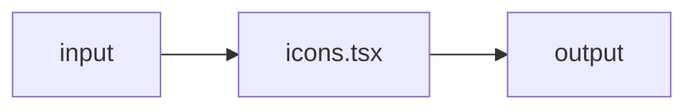

# icons.tsx — AI component doc

> AI-facing sidecar for `icons.tsx`. Created 2026-07-08. Keep this in sync with the code on every change.

## Purpose
_What this file/component is and why it exists (one or two sentences)._

## What it does (for an AI reader)
- Responsibilities:
- Public API / exports / props / endpoints:
- Inputs → Outputs:
- Side effects (I/O, network, state):

## Dependencies
- Imports / depends on:
- Used by:

## Diagram

## Key decisions / gotchas
-

## Commits
- _no commit yet_

## Update 2026-08-02 — PencilIcon + PlayIcon in, RegenerateIcon out

- `PencilIcon` (stroked, 24-grid, 1.5) leads the renamed **Edit** action; the old
  `RegenerateIcon` refresh loop was DELETED, not parked — nothing referenced it after the
  rename, and the design system does not keep glyphs "just in case" (design.md §10).
- `PlayIcon` is the one FILLED glyph in the file: it is painted over a frame of real
  footage on the video poster plate, where a 1.5px outline reads as noise rather than as
  an affordance. It is decoration (`aria-hidden`) — the plate's button carries the name.
