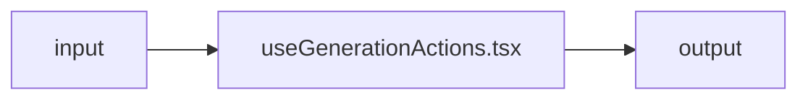

# useGenerationActions.tsx — AI component doc

> AI-facing sidecar for `useGenerationActions.tsx`. Created 2026-07-08. Keep this in sync with the code on every change.

## Purpose
_What this file/component is and why it exists (one or two sentences)._

## What it does (for an AI reader)
- Responsibilities:
- Public API / exports / props / endpoints:
- Inputs → Outputs:
- Side effects (I/O, network, state):

## Dependencies
- Imports / depends on:
- Used by:

## Diagram

## Key decisions / gotchas
-

## Commits
- _no commit yet_

## Update 2026-08-02 — "Regenerate" became **Edit**, and the icon rail is gone

- The action's LABEL is now `gallery.actions.edit` ("Edit" / «Редактировать») with a
  `PencilIcon`. The id stays `regenerate`: `GenerationDetail` keys its "close the sheet
  after this one" rule off it, and the string never travelled the wire.
- Why: the action loads the prompt + model back into the composer and STOPS. Nothing is
  regenerated until the user submits, so "Regenerate" made a free action look like a paid
  one. The old `gallery.actions.regenerate` key stays in both locale files (the
  keys-intact rule, design.md §13 recorded exceptions).
- All three consumers now paint the same shape — a ⋯ `Menu`. The detail view's icon rail
  was retired: it put Delete at Download's visual weight directly under the media.
