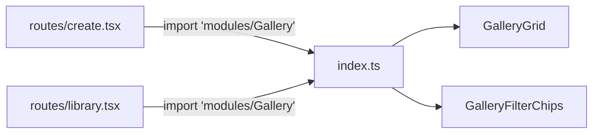

# index.ts — AI component doc

> AI-facing sidecar for `modules/Gallery/index.ts`. Created 2026-07-06. Keep this in sync with the code on every change.

## Purpose

Public API of the Gallery module — the single legal import point
(`import { GalleryGrid, GalleryFilterChips } from 'modules/Gallery'`).

## What it does (for an AI reader)

- Responsibilities: re-export the module's public surface; nothing else.
- Public API / exports: `GalleryGrid` (+`GalleryGridProps`, `GalleryFilter`),
  `GalleryFilterChips` (+`GalleryFilterChipsProps`).
- Inputs → Outputs: import from `'modules/Gallery'` → grid + chips.
- Side effects: none.

## Dependencies

- Imports: `./components/GalleryGrid`, `./components/GalleryFilterChips`.
- Used by: `routes/create.tsx` (embedded grid), `routes/library.tsx` (grid + chips).

## Diagram

## Key decisions / gotchas

- `GenerationCard`, `GenerationDetail`, and the whole `model/` layer stay
  private: polling, invalidation, and optimistic delete are grid internals.
  The Generator feeds this module only through the shared `['generations']` cache key.

## Commits

- (pending) feat(web): gallery with 4-state cards and 4s polling of processing items
