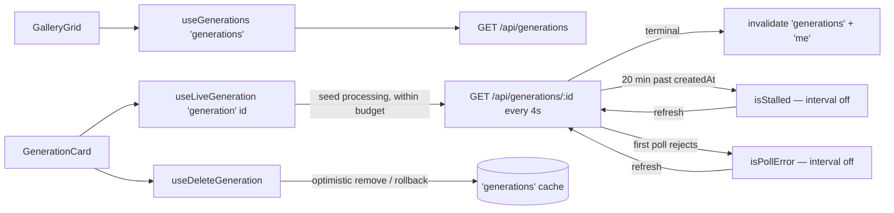

# generationsApi.ts — AI component doc

> AI-facing sidecar for `generationsApi.ts`. Created 2026-07-06. Keep this in sync with the code on every change.

## Purpose

Server-state hooks of the Gallery module: the infinite generations list, the
4-second polling of processing items (bounded by a 20-minute budget), and the
optimistic delete.

## What it does (for an AI reader)

- Responsibilities: all Gallery network state; no UI.
- Public API / exports:
  - `GENERATION_STALL_MS` — the 20-minute polling budget since `createdAt`.
  - `useGenerations()` — `useInfiniteQuery` on `['generations']`;
    `GET /api/generations?limit=24[&cursor=…]`; `getNextPageParam = nextCursor` (null ends paging).
  - `useLiveGeneration(seed: Generation, options?: { now?: () => number })` →
    `LiveGenerationResult { generation, isStalled, isPollError, refresh, isRefreshing }` —
    while the list item is `processing`, polls `GET /api/generations/:id` on
    `['generation', id]` with `refetchInterval` 4000ms; the interval stops on a
    terminal state, on a first-poll failure (`isPollError`), or once
    `now() - createdAt >= GENERATION_STALL_MS` (`isStalled`). `refresh()` runs one
    manual poll (`refetch`) — the stalled "refresh" and the error retry.
    On the processing→terminal transition invalidates `['generations']` + `['me']` once.
  - `useDeleteGeneration()` — `DELETE /api/generations/:id`; `onMutate` removes the item
    from every cached page (snapshot kept), `onError` rolls back, `onSettled` revalidates.
- Inputs → Outputs: cursor pages → `GenerationList`; seed DTO + optional clock →
  live DTO + stall/error flags; id → 204.
- Side effects: network via `shared/libs/apiClient`; writes to the shared query cache.

## Dependencies

- Imports: `react` (`useEffect`, `useRef`), `@tanstack/react-query`, `@opencreate/contracts`, `shared/libs/apiClient`.
- Used by: `components/GalleryGrid.tsx` (list), `components/GenerationCard.tsx`
  (live view + delete).

## Diagram

## Key decisions / gotchas

- Polling is per-CARD and gated on the LIST's status (`enabled: isSeedProcessing`):
  terminal items never fire requests (plan: "single-item query only while processing").
- Our API re-polls Runware on each GET — the 4s interval is the whole async
  video pipeline in MVP (no websockets, no workers).
- **Bounded polling (QA finding 1).** `refetchInterval` re-evaluates after every
  fetch: it returns `false` past `GENERATION_STALL_MS` since `createdAt`, so the
  interval dies on the first tick past the wall. A card MOUNTED past the wall
  still runs the one mount fetch (honest status check), then no interval.
- **First-poll failure (QA finding 2).** `isPollError` requires `data ===
  undefined`: a background failure AFTER data keeps rendering the last answer
  and keeps polling (one blip must not kill the live view); a failure BEFORE
  any data stops the interval and the card shows ErrorState + retry.
- `now()` is injectable (`options.now`) because fake timers cannot move
  `Date.now` past a 20-minute wall deterministically in tests.
- `refresh()` is one manual `refetch()` — "restarts polling once". If the answer
  is still processing and within budget, the interval resumes by itself.
- `didInvalidateRef` fires the invalidation exactly once per card instance; the
  refetched list flips `seed.status`, which disables the poll query naturally.
- `['me']` is invalidated on ANY terminal transition — harmless after success,
  required after failure (server refunded the charge).
- Delete cancels in-flight list queries first so a racing refetch cannot
  resurrect the optimistically removed row.

## Commits

- 9ffc310 2026-07-06 feat(web): gallery with 4-state cards and 4s polling of processing items
- 74f4c59 2026-07-07 fix(web): polling bounds + stalled/error card states
