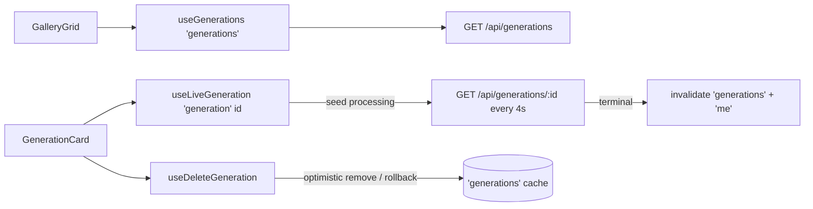

# generationsApi.ts — AI component doc

> AI-facing sidecar for `generationsApi.ts`. Created 2026-07-06. Keep this in sync with the code on every change.

## Purpose

Server-state hooks of the Gallery module: the infinite generations list, the
4-second polling of processing items, and the optimistic delete.

## What it does (for an AI reader)

- Responsibilities: all Gallery network state; no UI.
- Public API / exports:
  - `useGenerations()` — `useInfiniteQuery` on `['generations']`;
    `GET /api/generations?limit=24[&cursor=…]`; `getNextPageParam = nextCursor` (null ends paging).
  - `useLiveGeneration(seed: Generation)` → `Generation` — while the list item is
    `processing`, polls `GET /api/generations/:id` on `['generation', id]` with
    `refetchInterval` 4000ms (stops on terminal); returns the fresher of poll/list data.
    On the processing→terminal transition invalidates `['generations']` + `['me']` once.
  - `useDeleteGeneration()` — `DELETE /api/generations/:id`; `onMutate` removes the item
    from every cached page (snapshot kept), `onError` rolls back, `onSettled` revalidates.
- Inputs → Outputs: cursor pages → `GenerationList`; seed DTO → live DTO; id → 204.
- Side effects: network via `shared/libs/apiClient`; writes to the shared query cache.

## Dependencies

- Imports: `react` (`useEffect`, `useRef`), `@tanstack/react-query`, `@opencreate/contracts`, `shared/libs/apiClient`.
- Used by: `components/GalleryGrid.tsx` (list), `components/GenerationCard.tsx`
  (live view + delete).

## Diagram

## Key decisions / gotchas

- Polling is per-CARD and gated on the LIST's status (`enabled: isSeedProcessing`):
  terminal items never fire requests (plan: "single-item query only while processing").
- Our API re-polls Runware on each GET — the 4s interval is the whole async
  video pipeline in MVP (no websockets, no workers).
- `didInvalidateRef` fires the invalidation exactly once per card instance; the
  refetched list flips `seed.status`, which disables the poll query naturally.
- `['me']` is invalidated on ANY terminal transition — harmless after success,
  required after failure (server refunded the charge).
- Delete cancels in-flight list queries first so a racing refetch cannot
  resurrect the optimistically removed row.

## Commits

- 9ffc310 2026-07-06 feat(web): gallery with 4-state cards and 4s polling of processing items
