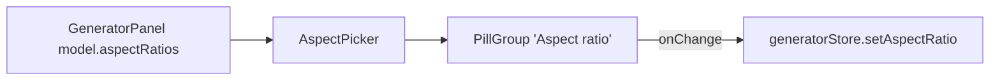

# AspectPicker.tsx — AI component doc

> AI-facing sidecar for `AspectPicker.tsx`. Created 2026-07-06. Keep this in sync with the code on every change.

## Purpose

Aspect-ratio segmented control of the Generator panel — a thin, localized
wrapper over the shared `PillGroup`.

## What it does (for an AI reader)

- Responsibilities: present the model-supported aspect ratios as pills. Controlled; no state.
- Public API / exports: `AspectPicker` with `AspectPickerProps = { options: AspectRatio[], value: AspectRatio, onChange(ratio) }`.
- Inputs → Outputs: filtered options + current value → `onChange` with the clicked `AspectRatio`.
- Side effects: none.

## Dependencies

- Imports: `react-i18next`, `@opencreate/contracts` (`AspectRatio`), `shared/ui` (`PillGroup`).
- Used by: `components/GeneratorPanel.tsx`.

## Diagram

## Key decisions / gotchas

- Options are filtered by the PANEL from the selected model — the picker never
  sees unsupported ratios, so an invalid selection is impossible by construction.
- Ratio strings ("16:9") are universal notation, deliberately untranslated;
  only the group label is localized.

## Commits

- (pending) feat(web): generator module — prompt, model/aspect/duration, i2v upload, cost
