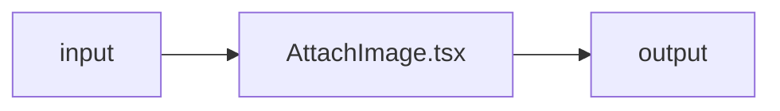

# AttachImage.tsx — AI component doc

> AI-facing sidecar for `AttachImage.tsx`. Created 2026-07-08. Keep this in sync with the code on every change.

## Purpose
_What this file/component is and why it exists (one or two sentences)._

## What it does (for an AI reader)
- Responsibilities:
- Public API / exports / props / endpoints:
- Inputs → Outputs:
- Side effects (I/O, network, state):

## Dependencies
- Imports / depends on: `react` (`useRef`, `useState`), `react-i18next`, and the
  shared image gate `shared/libs/readImageFile` (moved out of `Generator/model`
  on 2026-07-22 so Cinema shares the same caps without a cross-module import).
- Used by: `components/ChatComposer.tsx` (the docked composer's input row, only
  when `model.supportsImageInput`; the composer also owns paste + drag-drop that
  route through the same `readImageFile` gate).

## Diagram

## Key decisions / gotchas
-

## Commits
- _no commit yet_
