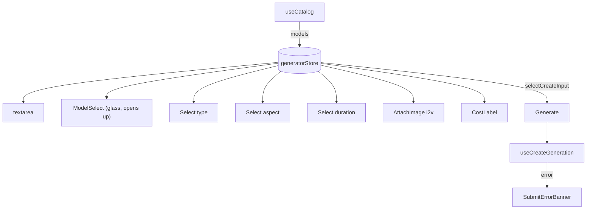

# ChatComposer.tsx — AI component doc

> AI-facing sidecar for `ChatComposer.tsx`. Created 2026-07-08. Keep this in sync with the code on every change.

## Purpose
The docked "chat" composer for `/create` — a floating TRANSPARENT capsule (the pen) pinned to the bottom of the media feed; since 2026-07-15 the block itself carries no fill/blur/shadow (owner call), only geometry — the feed shows through the whole block, and legibility is carried by the inner controls' own surfaces. Sibling to `GeneratorPanel` over the SAME store/mutation/catalog, different posture. This is the LIVE model-picking surface (the route renders `ChatComposer`, not `GeneratorPanel`).

## What it does (for an AI reader)
- Responsibilities: prompt textarea (Enter submits, Shift+Enter newlines); a settings strip (type / model / aspect+resolution / duration / attachment); cost + Generate; catalog 4-states; inline submit errors.
- Public API / exports / props / endpoints: `ChatComposer` (no props — state in `generatorStore`). Consumes `useCatalog`, `useCreateGeneration`.
- Inputs → Outputs: user edits → store actions; submit → `useCreateGeneration.mutate(input)`; failures → `SubmitErrorBanner`.
- Side effects (I/O, network, state): `useEffect` syncs `catalog.data.models` → store; catalog query; mutation.

## Dependencies
- Imports / depends on: `shared/ui` (`Button`, `EmptyState`, `ErrorState`, `Select`, `Skeleton` — `GLASS_FLOATING` no longer imported); `ModelSelect`, `AttachImage`, `MentionControl`, `CostLabel`, `SubmitErrorBanner`; module model (`catalogApi`, `createGeneration`, `generatorStore`, `mentions`); `@opencreate/contracts` (`formatResolution`, `resolutionFor`); `react-i18next`.
- Used by: `routes/_shell.create.tsx` via `modules/Generator` public API.

## Diagram

## Key decisions / gotchas
- CAPSULE IS TRANSPARENT (2026-07-15, owner call): `CAPSULE_CLASS` no longer includes `GLASS_FLOATING` — no fill, no backdrop-blur, no shadow, no border; only pill radius, padding and `pointer-events-auto` remain. The user asked for the WHOLE pinned block to be see-through, not just the textarea. The shared glass recipe in `shared/ui/surfaces.ts` is untouched (Modal/Card/Select still use it); the change is local to this file.
- The MODEL control is the one exception to the "every control is the same glass Select" rule: it is now the custom `ModelSelect` (variant `glass`) — logo + tariff + description, in an OPAQUE popup that opens UPWARD (the capsule sits at the viewport bottom) and stays readable over busy media. Type/aspect/duration remain the compact glass `Select`.
- `ModelSelect` shows ALL models (not filtered by `state.type`); picking a video model while on 'image' flips the type via the store's `normalizeFor`. The old `modelOptionLabel` helper and `typeModels` filter were removed.
- Glass baseline is opaque `bg-ridge`; `supports-[backdrop-filter]` upgrades it — the ModelSelect panel does NOT depend on backdrop-filter (always opaque steel).
- NOT PRESENT deliberately: quality/4K selector and free width×height (API derives resolution from model tier × aspect).

## Commits
- _no commit yet_
