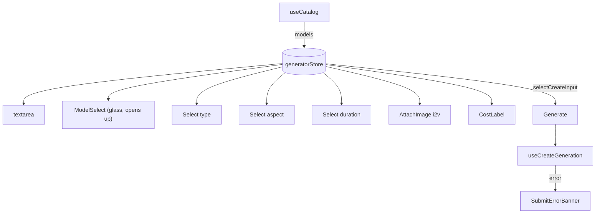

# ChatComposer.tsx — AI component doc

> AI-facing sidecar for `ChatComposer.tsx`. Created 2026-07-08. Keep this in sync with the code on every change.

## Purpose
The docked "chat" composer for `/create` — a floating FROSTED-GLASS capsule (the pen) pinned to the bottom of the media feed; since 2026-07-17 it wears `GLASS_FLOATING` again (owner reversal — the transparent experiment left the text unreadable over feed cards). Sibling to `GeneratorPanel` over the SAME store/mutation/catalog, different posture. This is the LIVE model-picking surface (the route renders `ChatComposer`, not `GeneratorPanel`).

## What it does (for an AI reader)
- Responsibilities: prompt textarea (Enter submits, Shift+Enter newlines); a settings strip (type / model / aspect+resolution / duration / attachment); cost + Generate; catalog 4-states; inline submit errors; image attach by click (AttachImage) AND by paste + drag-drop onto the capsule.
- Public API / exports / props / endpoints: `ChatComposer` (no props — state in `generatorStore`). Consumes `useCatalog`, `useCreateGeneration`.
- Inputs → Outputs: user edits → store actions; submit → `useCreateGeneration.mutate(input)`; failures → `SubmitErrorBanner`.
- Side effects (I/O, network, state): `useEffect` syncs `catalog.data.models` → store; catalog query; mutation.

## Dependencies
- Imports / depends on: `shared/ui` (`Button`, `EmptyState`, `EnhanceButton`, `ErrorState`, `GLASS_FLOATING`, `Select`, `Skeleton`); `shared/libs/readImageFile` (the one image gate — shared with Cinema, so paste/drop/click never fork the caps); `ModelSelect`, `AttachImage`, `MentionControl`, `CostLabel`, `SubmitErrorBanner`; module model (`catalogApi`, `createGeneration`, `generatorStore`, `mentions`); `@opencreate/contracts` (`formatResolution`, `resolutionFor`); `react-i18next`.
- Used by: `routes/_shell.create.tsx` via `modules/Generator` public API.

## Diagram

## Key decisions / gotchas
- CAPSULE WEARS GLASS AGAIN (2026-07-17, owner reversal of the 2026-07-15 transparency call): `CAPSULE_CLASS` = pill geometry + `border` + `GLASS_FLOATING`. Fully transparent, the placeholder / price / settings strip sat DIRECTLY over the feed's cards and became unreadable — reported as «поле пропало, бэкграунда нет». Frosted glass keeps the feed visible through the blur while text stays legible over any media.
- The MODEL control is the one exception to the "every control is the same glass Select" rule: it is now the custom `ModelSelect` (variant `glass`) — logo + tariff + description, in an OPAQUE popup that opens UPWARD (the capsule sits at the viewport bottom) and stays readable over busy media. Type/aspect/duration remain the compact glass `Select`.
- `ModelSelect` shows ALL models (not filtered by `state.type`); picking a video model while on 'image' flips the type via the store's `normalizeFor`. The old `modelOptionLabel` helper and `typeModels` filter were removed.
- Glass baseline is opaque `bg-ridge`; `supports-[backdrop-filter]` upgrades it — the ModelSelect panel does NOT depend on backdrop-filter (always opaque steel).
- NOT PRESENT deliberately: quality/4K selector and free width×height (API derives resolution from model tier × aspect).
- AI ENHANCE (2026-07-21): the shared `EnhanceButton` sits in the controls cluster (left of `CostLabel`/Generate), wired to `state.prompt` / `state.setPrompt`. Enhance/undo is just another `setPrompt`, so the `[[eN]]` mention tokens and the `selectCreateInput` submit gate keep working unchanged. Same component + `shared/model` hook as the Cinema shot prompt — no cross-module import, no duplicate.
- PASTE + DROP IMAGE (2026-07-22): the `<section>` capsule carries `onPaste`/`onDrop`/`onDragOver`/`onDragLeave`. A screenshot pasted (onPaste bubbles from the textarea) or dropped anywhere on the composer routes through the SAME `readImageFile` gate as the paperclip and sets `state.setInputImage` — click still works, unchanged. Guarded on `model?.supportsImageInput` (no-op otherwise); a text paste (no `clipboardData.files`) is left untouched so typing is normal. A gate reject shows a localized `role="alert"` line; a drag-over paints a `ring-portal`. React-synthetic handlers = element-scoped, so no document listener leaks. `useState` for the ring + reject key is declared BEFORE the catalog early-returns (hooks rule).

## Update 2026-07-24 — INLINE "@" mention picker
- Typing `@` in the textarea now opens an inline picker (`MentionAutocomplete`) listing taggable entities with their reference-image thumbnails, filtered by the text after `@`. Selecting one splices its `[[eN]]` token at the caret (`shared/libs/mentionQuery.ts` `findActiveMention`/`applyMention`) and registers the mention (`state.addMention`). This is the requested Higgsfield-style `@` affordance — the previous `MentionControl` `@ add` BUTTON (chips + menu) stays for removal/visibility.
- State (all declared before the catalog early-returns, hooks rule): `textareaRef`, `mention` (active `@query` | null), `mentionIndex` (keyboard highlight). `caretTargetRef` is a REF (not state — avoids setState-in-effect); a `useEffect` keyed on `state.prompt` restores the caret past the spliced token once the new value renders (a controlled textarea otherwise jumps it to the end).
- `handlePromptChange` recomputes the active `@query` from the NEW value + `selectionStart` on every keystroke; `handleKeyDown` lets the OPEN picker own ↑/↓/Enter/Tab/Esc (Enter picks, never submits); `onBlur` closes it. Gated by the same one-reference cap as the button (`hasMention`) and only opens when the library is non-empty.
- `TaggableEntity` widened with `imageUrl?` (route `_shell.create.tsx` derives it from the entity's `primaryImageId`/first image). Behaviour pinned by `ChatComposer.test.tsx` (open/filter/select/Enter/empty) + `shared/libs/mentionQuery.test.ts`.

## Update 2026-07-24 — the "@" halves moved to shared
- `mentionQuery` (caret math) now imports from `shared/libs/mentionQuery`, and `MentionAutocomplete` from `shared/ui` — both MOVED there so the Cinema shot composer can speak the same `@` protocol (modules may not import each other). The popup's strings are passed as props now (`label`/`emptyText` from `generator.mention.*`) and its list prop is `items`; behaviour here is byte-for-byte unchanged.

## Commits
- _no commit yet_
