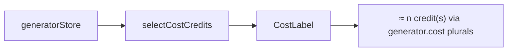

# CostLabel.tsx — AI component doc

> AI-facing sidecar for `CostLabel.tsx`. Created 2026-07-06. Keep this in sync with the code on every change.

## Purpose

Live credit-price readout of the Generator draft ("≈ 35 credits"), shown next
to the submit button so choice and cost are always visible together.

## What it does (for an AI reader)

- Responsibilities: format the current price with localized pluralization. Pure presentational.
- Public API / exports: `CostLabel` with `CostLabelProps = { credits: number | null }`.
- Inputs → Outputs: `credits` from `selectCostCredits` → localized text; `null` → renders nothing.
- Side effects: none.

## Dependencies

- Imports: `react-i18next`.
- Used by: `components/GeneratorPanel.tsx`.

## Diagram

## Key decisions / gotchas

- Pluralized through i18next `count` (`cost_one/cost_other` en;
  `cost_one/few/many/other` ru) — never string-concatenated.
- Renders nothing for `null` (no model/duration resolved) — a wrong or empty
  number would undermine the product's honest-pricing promise.
- Stage 3 restyle (2026-07-07): the line is now a serif display numeral
  (`font-display text-2xl`, brief: "cost line as serif numeral") in the sheet
  footer — the same headline voice as the landing's price index. Text content and
  `data-testid="cost-label"` untouched.

## Commits

- 2b7dd54 2026-07-06 feat(web): generator module — prompt, model/aspect/duration, i2v upload, cost
- cb228e3 2026-07-07 restyle(web): editorial app shell, auth, generator, gallery
