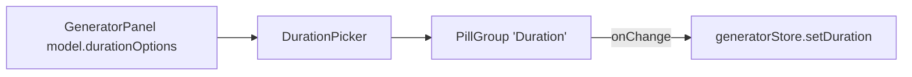

# DurationPicker.tsx — AI component doc

> AI-facing sidecar for `DurationPicker.tsx`. Created 2026-07-06. Keep this in sync with the code on every change.

## Purpose

Video-duration pill selector of the Generator panel ("5s"/"8s") — a thin,
localized wrapper over the shared `PillGroup`.

## What it does (for an AI reader)

- Responsibilities: present the selected video model's `durationOptions` as pills. Controlled; no state.
- Public API / exports: `DurationPicker` with `DurationPickerProps = { options: number[], value: number | undefined, onChange(seconds) }`.
- Inputs → Outputs: seconds options + current value → `onChange` with the clicked number.
- Side effects: none.

## Dependencies

- Imports: `react-i18next`, `shared/ui` (`PillGroup`).
- Used by: `components/GeneratorPanel.tsx` (rendered ONLY when the selected model is video).

## Diagram

## Key decisions / gotchas

- Never rendered for image models (the panel gates it) — duration is a
  video-only dimension, and the cost table is keyed by it.
- Pill labels go through `generator.duration.seconds` with `count` interpolation
  so the seconds suffix localizes ("5s" en / "5 с" ru).

## Commits

- (pending) feat(web): generator module — prompt, model/aspect/duration, i2v upload, cost
