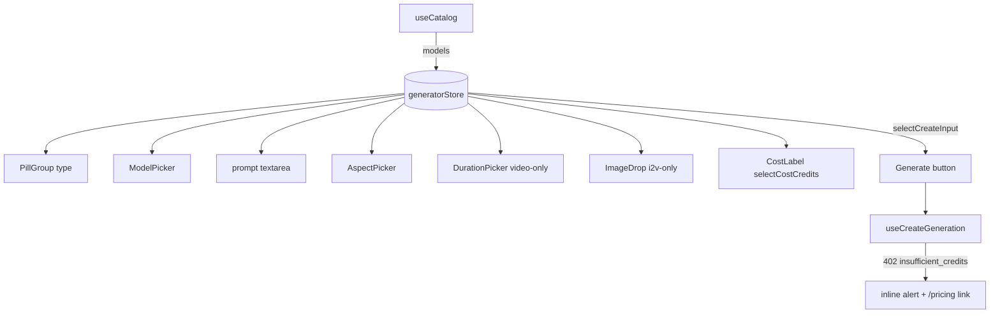

# GeneratorPanel.tsx — AI component doc

> AI-facing sidecar for `GeneratorPanel.tsx`. Created 2026-07-06. Keep this in sync with the code on every change.

## Purpose

The Generator module's main surface (create page): the full generation form —
type toggle, model cards, prompt, aspect/duration, optional i2v upload, live
cost, submit — orchestrating the store, the catalog query, and the mutation.

## What it does (for an AI reader)

- Responsibilities: catalog 4-states (skeletons / ErrorState retry / defensive
  EmptyState / form); sync catalog → store; render sub-pickers from store state;
  gate submit on `selectCreateInput`; surface mutation failures inline.
- Public API / exports: `GeneratorPanel` (no props — state lives in `generatorStore`).
- Inputs → Outputs: user edits → store actions; submit → `useCreateGeneration.mutate(input)`;
  `insufficient_credits` → inline `role="alert"` banner + `/pricing` link; other errors →
  localized generic banner.
- Side effects: `useEffect` pushes `catalog.data.models` into the store (cache → store sync).

## Dependencies

- Imports: `shared/ui` (`Button`, `EmptyState`, `ErrorState`, `PillGroup`, `Skeleton`),
  `shared/libs/apiClient` (`ApiClientError`), module model (`catalogApi`, `createGeneration`,
  `generatorStore`), sibling components (`AspectPicker`, `CostLabel`, `DurationPicker`,
  `ImageDrop`, `ModelPicker`), `react-i18next`.
- Used by: `routes/create.tsx` via `modules/Generator` public API.

## Diagram

## Key decisions / gotchas

- Prompt is a plain store-backed textarea, NOT React Hook Form: the plan puts the
  whole draft in the Zustand store and validation is the contracts zod schema via
  `selectCreateInput` — a parallel RHF state would just duplicate it (recorded deviation).
- `/pricing` link is a plain `<a>` until plan Task 20 creates the route (typed
  `<Link>` union does not include it yet) — same escape-hatch convention as login.tsx used pre-Task 16.
- Duration and ImageDrop are conditionally MOUNTED (not disabled): a control that
  cannot apply to the current model should not exist in the a11y tree.
- Insufficient credits is not a modal: the failure has an inline next step
  (pricing), so frontend-error-ux keeps it non-blocking.

## Commits

- (pending) feat(web): generator module — prompt, model/aspect/duration, i2v upload, cost
