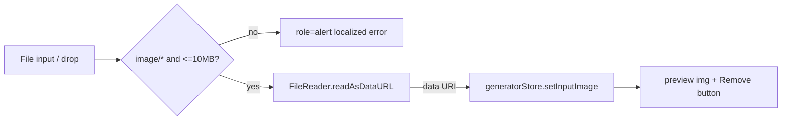

# ImageDrop.tsx — AI component doc

> AI-facing sidecar for `ImageDrop.tsx`. Created 2026-07-06. Keep this in sync with the code on every change.

## Purpose

i2v reference-image uploader of the Generator panel: file picker + drag-and-drop
that validates and converts the chosen image to a data URI for the store.

## What it does (for an AI reader)

- Responsibilities: pick/drop a file, validate (`image/*`, ≤10MB), `FileReader.readAsDataURL`,
  report the data URI; preview + remove when set; localized inline error otherwise.
- Public API / exports: `ImageDrop` with `ImageDropProps = { value: string | null, onChange(dataUri | null) }`.
- Inputs → Outputs: `File` from input/drop → `onChange('data:image/…')`; remove → `onChange(null)`;
  invalid file → `role="alert"` message, no `onChange`.
- Side effects: reads the file locally (FileReader). No network.

## Dependencies

- Imports: `react` (`useRef`, `useState`), `react-i18next`, `shared/ui` (`Button`).
- Used by: `components/GeneratorPanel.tsx` (rendered ONLY when `model.supportsImageInput`).

## Diagram

## Key decisions / gotchas

- 10MB file cap tracks the contracts `inputImage` 14MB cap on the base64 string
  (~4/3 inflation) — client rejects early instead of a 400 round-trip.
- Data URIs only, never URLs — the API's SSRF guard (contracts schema) requires it.
- Validation error is stored as an i18n KEY, translated at render, so a language
  switch re-localizes a visible error.
- Hidden-but-labelled real `<input type=file>` (sr-only): native picker,
  `userEvent.upload`-testable, visible button/dropzone stays a plain button.
- v3 terminal restyle: dropzone = dashed white/15 hairline directly on the void
  (`rounded-lg`) that brightens + steps toward `bg-ridge/30` on hover; the
  preview thumbnail sits on the ABYSS well (`bg-abyss` — the recessed surface
  step reserved for user media); validation errors are `text-glow-red` (the
  triad's failure color). Behavior and labels untouched.

## Commits

- 2b7dd54 2026-07-06 feat(web): generator module — prompt, model/aspect/duration, i2v upload, cost
- cb228e3 2026-07-07 restyle(web): editorial app shell, auth, generator, gallery
- (pending) restyle(web): terminal design system — cosmic void tokens, jetbrains mono, specimen pills + docs
