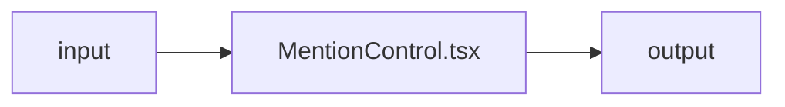

# MentionControl.tsx — AI component doc

> AI-facing sidecar for `MentionControl.tsx`. Created 2026-07-09. Keep this in sync with the code on every change.

## Purpose
_What this file/component is and why it exists (one or two sentences)._

## What it does (for an AI reader)
- Responsibilities:
- Public API / exports / props / endpoints:
- Inputs → Outputs:
- Side effects (I/O, network, state):

## Dependencies
- Imports / depends on:
- Used by:

## Diagram

## Key decisions / gotchas
- 2026-07-24: `TaggableEntity` widened with `imageUrl?: string | null` — consumed by the new inline `@` picker (`MentionAutocomplete`) for thumbnails; THIS chip control ignores it. MentionControl itself is unchanged (chips + `@ add` button remain for removal/visibility alongside the inline picker).

## Commits
- _no commit yet_
