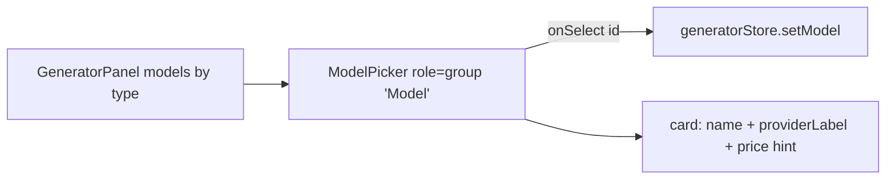

# ModelPicker.tsx — AI component doc

> AI-facing sidecar for `ModelPicker.tsx`. Created 2026-07-06. Keep this in sync with the code on every change.

## Purpose

Model-card selector of the Generator panel: one pressed-state card per catalog
model of the current type, each showing product name + honest provider label +
credit price.

## What it does (for an AI reader)

- Responsibilities: render selectable model cards (`aria-pressed`). Controlled; no state.
- Public API / exports: `ModelPicker` with `ModelPickerProps = { models: CatalogModel[], selectedId: string | null, onSelect(modelId) }`.
- Inputs → Outputs: type-filtered models + selection → `onSelect` with the clicked model id.
- Side effects: none.

## Dependencies

- Imports: `react-i18next`, `i18next` (`TFunction` type for the `priceHint` helper —
  a structural signature fights `exactOptionalPropertyTypes`), `@opencreate/contracts` (`CatalogModel`).
- Used by: `components/GeneratorPanel.tsx`.

## Diagram

## Key decisions / gotchas

- Provider label is always visible under our product name — the spec's honesty
  rule (users see "FLUX schnell" / "PixVerse V6", never a rebadged black box).
- Price hint: image → flat `generator.cost` ("≈ 1 credit"); video →
  `generator.model.from` with the CHEAPEST duration ("from 35") so cards stay
  comparable before a duration is picked.
- Custom cards instead of shared `PillGroup`: cards carry three lines of
  content, not a single label — different component class (module-owned UI).
- v3 stage-3 restyle: catalog cards are STEEL TILES (`rounded-lg bg-steel`,
  white/10 hairline — "cards on #1d293d", design.md §2) with `font-medium
  text-white` model name (500 = the weight ceiling) and quiet lowercase mono
  captions; SELECTED = the AMBER RING (`border-glow-amber/60`, price hint
  `text-glow-amber`) because the reference files "model picker highlights"
  under amber — the earlier amber bg wash was dropped so the tile surface
  stays steel and only the ring + hint carry selection (aria-pressed carries
  it for AT); unselected hover steps the surface to `bg-ridge`. Never a solid
  fill. Roles (`aria-pressed`, group name) and i18n untouched.

## Commits

- 2b7dd54 2026-07-06 feat(web): generator module — prompt, model/aspect/duration, i2v upload, cost
- cb228e3 2026-07-07 restyle(web): editorial app shell, auth, generator, gallery
- 252ab38 2026-07-07 restyle(web): terminal design system — cosmic void tokens, jetbrains mono, specimen pills + docs
