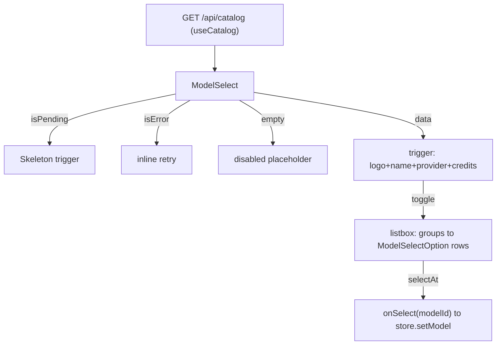

# ModelSelect.tsx — AI component doc

> AI-facing sidecar for `ModelSelect.tsx`. Created 2026-07-08. Keep this in sync with the code on every change.

## Purpose
The custom, on-brand model select — a fully self-contained WAI-ARIA listbox (NOT a native `<select>`) showing every catalog model with a provider logo, tariff (credits + $), tier chip and localized description, grouped Images / Video. Replaces the old `ModelPicker` tiles (GeneratorPanel) and the plain model `Select` (ChatComposer).

## What it does (for an AI reader)
- Responsibilities: own the catalog query + its four UI states; render the trigger (selected model summary) and the grouped listbox panel; delegate selection up.
- Public API / exports / props / endpoints: `ModelSelect({ selectedId, onSelect, variant?: 'sheet' | 'glass' })`. Consumes `GET /api/catalog` via `useCatalog`.
- Inputs → Outputs: `selectedId` + catalog data → trigger + panel; user pick → `onSelect(modelId)`.
- Side effects (I/O, network, state): TanStack Query catalog fetch; local open/active state via `useModelListbox`. The enter transition is pure CSS (`@starting-style` via Tailwind `starting:`) — no effect/state.

## Dependencies
- Imports / depends on: `useCatalog` (`../model/catalogApi`); `useModelListbox` (`../hooks/useModelListbox`); `presentationFor`/`tariffFor` (`../model/modelPresentation`); `ModelSelectOption`, `ProviderMark`; `Skeleton` from `shared/ui`; `react-i18next`.
- Used by: `GeneratorPanel.tsx` (`variant="sheet"`) and `ChatComposer.tsx` (`variant="glass"`).

## Diagram

## Key decisions / gotchas
- Owns `useCatalog` so it is drop-in self-contained; both consumers already gate globally on the same cached `['catalog']` query, so there is no extra fetch and its loading/error paths mainly matter in isolation/tests.
- Panel is ALWAYS opaque `bg-steel` (readable over the composer's frosted glass); only the resting TRIGGER fill changes by `variant`. No gradients.
- `flat` (images-then-videos) must match the render order so `activeIndex` from `useModelListbox` maps to the right row; option index is resolved via `flat.findIndex`.
- Selecting a video model while type='image' is fine — the store's `setModel`/`normalizeFor` switches type and resets duration.
- Hooks (`useModelListbox`, `useState`, `useEffect`) run BEFORE the four-state early returns (Rules of Hooks).

## Update 2026-07-15 — presentation sources moved to shared
- `presentationFor`/`tariffFor` now import from `shared/libs/modelPresentation`,
  `ProviderMark` from `shared/ui` — moved so CinemaStudio's ModelPickerModal can
  reuse them (modules must not import each other). Behaviour unchanged.

## Commits
- _no commit yet_
