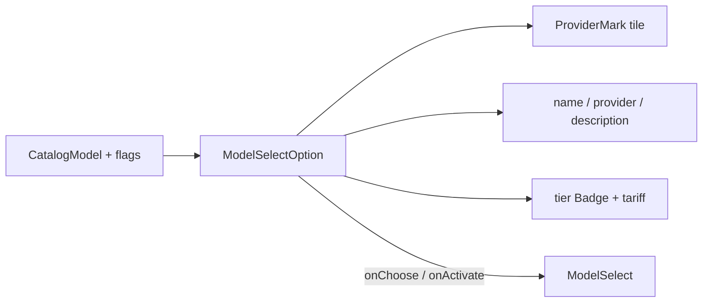

# ModelSelectOption.tsx — AI component doc

> AI-facing sidecar for `ModelSelectOption.tsx`. Created 2026-07-08. Keep this in sync with the code on every change.

## Purpose
One row of the `ModelSelect` listbox: provider logo, brand name + honest provider label, tier chip, tariff (credits + $), and a one-line description. Extracted so `ModelSelect` stays under the 200-line cap.

## What it does (for an AI reader)
- Responsibilities: present a single catalog model as a `role="option"` row and report choose/activate intent.
- Public API / exports / props / endpoints: `ModelSelectOption({ model, optionId, isSelected, isActive, onChoose, onActivate })`.
- Inputs → Outputs: a `CatalogModel` + selection/active flags → a rendered option row; `onClick`→`onChoose`, `onMouseEnter`→`onActivate`.
- Side effects (I/O, network, state): none — presentational.

## Dependencies
- Imports / depends on: `react-i18next` (tier/tariff/description strings); `CatalogModel` type; `Badge` from `shared/ui`; `presentationFor`/`tariffFor` from `../model/modelPresentation`; `ProviderMark`.
- Used by: `ModelSelect.tsx` (one per catalog model, grouped by type).

## Diagram

## Key decisions / gotchas
- The row is a `div role="option"`, NOT a button: the listbox (not each row) owns keyboard focus (`aria-activedescendant` pattern), so nested buttons would double-up the tab/focus model.
- Selection is the amber ring + `aria-selected` (shape + AT, not colour-only); active/hover is a one-step surface lift to `bg-ridge`. They can combine.
- Tier and tariff are localized (`generator.tier.*`, `generator.model.tariff`); pricing numbers come from `tariffFor(model)`, never hardcoded.

## Commits
- _no commit yet_
