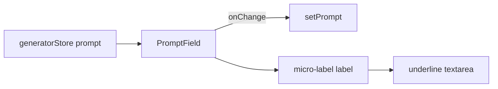

# PromptField.tsx — AI component doc

> AI-facing sidecar for `PromptField.tsx`. Created 2026-07-07 (stage 3 editorial
> redesign). Keep this in sync with the code on every change.

## Purpose

The commission sheet's prompt group: uppercase micro-label + hairline underline
textarea. Extracted from `GeneratorPanel` during the stage-3 restyle to keep the
panel under the 200-line component cap.

## What it does (for an AI reader)

- Responsibilities: render the labelled prompt textarea in the editorial underline
  treatment; forward keystrokes to the store action.
- Public API / exports / props / endpoints: `PromptField({ value, onChange })`,
  `PromptFieldProps`.
- Inputs → Outputs: `value` (draft prompt) → controlled textarea; `onChange(prompt)`
  on every keystroke.
- Side effects (I/O, network, state): none — `useId` only wires label→textarea.

## Dependencies

- Imports / depends on: `react` (useId), `react-i18next`.
- i18n keys: `generator.prompt.label`, `generator.prompt.placeholder`.
- Used by: `GeneratorPanel.tsx` (the "prompt" sheet field).

## Diagram

## Key decisions / gotchas

- shared/ui `Input` only ships an `<input>`; this is its textarea twin with the SAME
  underline recipe (1px rule → vermillion + box-shadow px on focus, no layout shift).
  If a second module ever needs a textarea, promote a shared `Textarea` instead of
  copying this again (design.md §10 governance).
- Uppercase label is CSS-only — `getByLabelText(/prompt/i)` matches the i18n string.

## Commits

- (pending) restyle(web): editorial app shell, auth, generator, gallery
