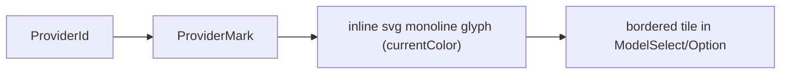

# ProviderMark.tsx — AI component doc

> AI-facing sidecar for `ProviderMark.tsx`. Created 2026-07-08. Keep this in sync with the code on every change.

## Purpose
Inline SVG provider logo marks for the model select — one crisp monoline glyph per brand, self-contained (no external image URLs, CSP-safe), drawn in `currentColor` so the surrounding tile owns the colour.

## What it does (for an AI reader)
- Responsibilities: render a decorative provider glyph given a `ProviderId`.
- Public API / exports / props / endpoints: `ProviderMark({ provider: ProviderId, className?: string })`. Default `className='h-6 w-6'` (24px); no colour of its own — inherits `currentColor`.
- Inputs → Outputs: `provider` → a 24×24 `viewBox` `<svg>` with a monoline glyph. `generic` is the fallback glyph.
- Side effects (I/O, network, state): none. `aria-hidden` (decorative — the brand name is shown as text beside it).

## Dependencies
- Imports / depends on: `ProviderId` type from `../model/modelPresentation`; `ReactNode` type from React.
- Used by: `ModelSelect.tsx` (trigger) and `ModelSelectOption.tsx` (rows), each wrapping it in a bordered `bg-steel` tile.

## Diagram

## Key decisions / gotchas
- ONE colour by design: the glyph geometry (bolt, play-in-frame, angular K, spark, horizon, play-in-ring, faceted node) carries brand identity, so the marks never introduce colours that would break the closed triad. No fills, no gradients (owner rule) — strokes only, round caps, crisp ~20–36px.
- Not trademark reproductions — abstract marks evoking each brand.
- `GLYPH` is a `Record<ProviderId, ReactNode>`; adding a `ProviderId` requires a glyph entry or TS errors (exhaustive by type).

## Commits
- _no commit yet_
