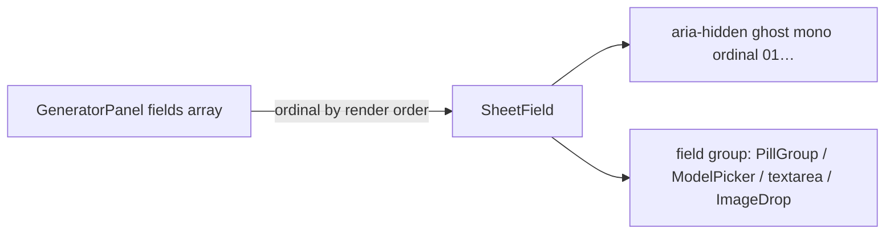

# SheetField.tsx — AI component doc

> AI-facing sidecar for `SheetField.tsx`. Created 2026-07-07 (stage 3 editorial
> redesign). Keep this in sync with the code on every change.

## Purpose

One numbered row of the GeneratorPanel "commission sheet" (brief: "numbered field
groups, hairline separators"): a decorative ghost mono ordinal (v3: `text-white/20`
weight 400) in the margin plus the field group content. Extracted so the panel
stays under the 200-line component cap.

## What it does (for an AI reader)

- Responsibilities: layout only — numeral column + content column with the sheet's
  vertical rhythm (`py-5`, trimmed at the sheet's first/last row).
- Public API / exports / props / endpoints: `SheetField({ ordinal, children })`,
  `SheetFieldProps`.
- Inputs → Outputs: `ordinal` string ("01"…) + any field group → a flex row; no state.
- Side effects (I/O, network, state): none.

## Dependencies

- Imports / depends on: `react` (ReactNode type only).
- Used by: `GeneratorPanel.tsx` (maps its visible field groups over this row; the
  hairline separators come from the parent's `divide-y`).

## Diagram

## Key decisions / gotchas

- Ordinals are DERIVED from render order (video adds duration/i2v rows), so they
  renumber when conditional groups appear — that is why they are decorative
  `aria-hidden` print furniture, never accessible names or i18n copy.
- Separators intentionally live on the parent (`divide-y divide-white/10`): a row
  that drew its own borders would double the hairline at conditional boundaries.
- `min-w-0 flex-1` on the content column: without it the model-card grid and the
  textarea can overflow the sheet's hairline frame.

## Commits

- cb228e3 2026-07-07 restyle(web): editorial app shell, auth, generator, gallery
- (pending) restyle(web): terminal design system — cosmic void tokens, jetbrains mono, specimen pills + docs
