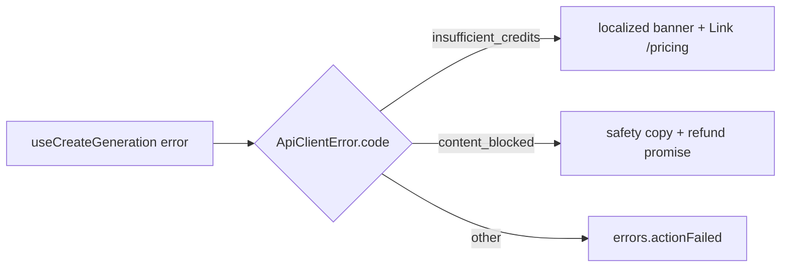

# SubmitErrorBanner.tsx — AI component doc

> AI-facing sidecar for `SubmitErrorBanner.tsx`. Created 2026-07-07 (stage 3
> editorial redesign). Keep this in sync with the code on every change.

## Purpose

Inline `role="alert"` banner for create-submit failures, extracted from
`GeneratorPanel` (200-line cap): maps `insufficient_credits` (+ /pricing link) and
`content_blocked` (refund promise) to dedicated localized copy, everything else to
the generic action-failed line.

## What it does (for an AI reader)

- Responsibilities: classify the mutation error via `ApiClientError.code`; render the
  matching localized message; offer the pricing link only for insufficient credits.
- Public API / exports / props / endpoints: `SubmitErrorBanner({ error })`,
  `SubmitErrorBannerProps` (`error: Error` — the caller renders it only on failure).
- Inputs → Outputs: mutation error → sand block with danger left rule; announced via
  `role="alert"`.
- Side effects (I/O, network, state): none; SPA navigation via typed `<Link>` only.

## Dependencies

- Imports / depends on: `@tanstack/react-router` (Link), `react-i18next`,
  `shared/libs/apiClient` (ApiClientError for `instanceof` + code checks).
- i18n keys: `generator.errors.insufficientCredits|seePricing|contentBlocked`,
  `errors.actionFailed`.
- Used by: `GeneratorPanel.tsx` (rendered between the sheet fields and the footer
  when `mutation.isError`).

## Diagram

## Key decisions / gotchas

- Editorial failure voice: sand tinted block + `border-l-2 border-danger`, body text
  ink — never a red panic panel (design.md §9); the pricing link is ink with a
  hairline underline that turns vermillion on hover (small vermillion text breaks §2).
- Raw server messages never render — only our i18n copy keyed off the machine code.
- Keeping this OUT of Modal is deliberate: both failures have inline next steps, so a
  blocking dialog would be worse UX (frontend-error-ux contract).

## Commits

- (pending) restyle(web): editorial app shell, auth, generator, gallery
