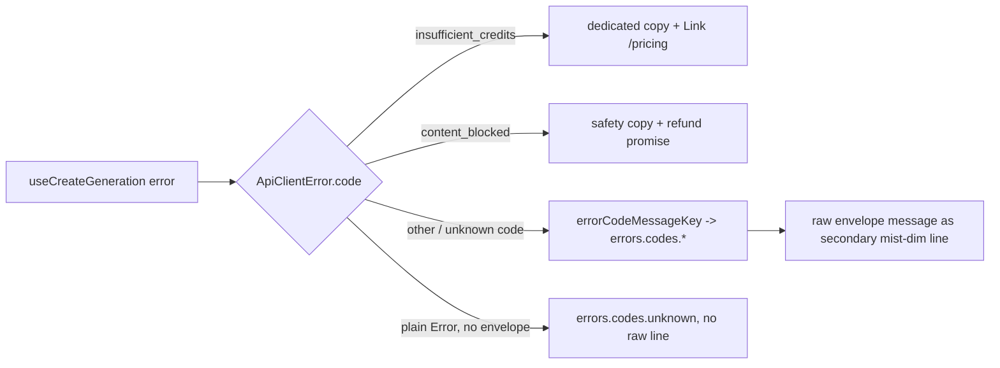

# SubmitErrorBanner.tsx — AI component doc

> AI-facing sidecar for `SubmitErrorBanner.tsx`. Created 2026-07-07 (stage 3
> editorial redesign). Keep this in sync with the code on every change.

## Purpose

Inline `role="alert"` banner for create-submit failures, extracted from
`GeneratorPanel` (200-line cap): EVERY envelope code renders localized primary
copy — `insufficient_credits` (+ /pricing link) and `content_blocked` (refund
promise) keep dedicated contextual wording, all other codes go through the
shared `errorCopy` map (unknown/future codes → generic), with the raw envelope
message allowed only as a secondary diagnostic line.

## What it does (for an AI reader)

- Responsibilities: classify the mutation error via `ApiClientError.code`; render the
  matching localized primary message (+ optional secondary raw detail); offer the
  pricing link only for insufficient credits.
- Public API / exports / props / endpoints: `SubmitErrorBanner({ error })`,
  `SubmitErrorBannerProps` (`error: Error` — the caller renders it only on failure).
- Inputs → Outputs: mutation error → steel block with glow-red left rule; announced
  via `role="alert"`. `provider_error` etc. → `errors.codes.*` primary + the raw
  envelope message as a `text-xs text-mist-dim` line; plain `Error` (network) →
  `errors.codes.unknown`, no raw line.
- Side effects (I/O, network, state): none; SPA navigation via typed `<Link>` only.

## Dependencies

- Imports / depends on: `@tanstack/react-router` (Link), `react-i18next`,
  `shared/libs/apiClient` (ApiClientError for `instanceof` + code checks),
  `shared/libs/errorCopy` (`errorCodeMessageKey`).
- i18n keys: `generator.errors.insufficientCredits|seePricing|contentBlocked`,
  `errors.codes.*`.
- Used by: `GeneratorPanel.tsx` (rendered between the sheet fields and the footer
  when `mutation.isError`).

## Diagram

## Key decisions / gotchas

- v3 failure voice: calm `bg-steel` surface block + `border-l-2 border-glow-red`
  (red stays on the RULE — the marker of failure — never on the whole panel,
  design.md §9); body text mist; the pricing link is portal blue, the sanctioned
  prose-link color, so recovery reads as navigation, not more alarm.
- Raw server text NEVER leads (QA finding 3): the primary line is always our
  i18n copy keyed off the machine code. The raw envelope message may trail as a
  secondary `text-mist-dim` line, but is suppressed for the two fully-worded
  codes (nothing to add), for moderation text (not user copy), and for plain
  exceptions ("Failed to fetch" explains nothing to a user).
- Unknown/future codes (e.g. one shipped to the API before the SPA redeploys)
  degrade to `errors.codes.unknown` via `errorCodeMessageKey` — never a crash,
  never raw text as primary.
- Keeping this OUT of Modal is deliberate: these failures have inline next steps, so a
  blocking dialog would be worse UX (frontend-error-ux contract).

## Commits

- cb228e3 2026-07-07 restyle(web): editorial app shell, auth, generator, gallery
- 252ab38 2026-07-07 restyle(web): terminal design system — cosmic void tokens, jetbrains mono, specimen pills + docs
- cc81faa 2026-07-07 fix(web): localized generation errors
