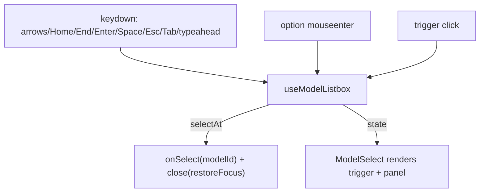

# useModelListbox.ts — AI component doc

> AI-facing sidecar for `useModelListbox.ts`. Created 2026-07-08. Keep this in sync with the code on every change.

## Purpose
Headless keyboard/focus/placement brain of the custom `ModelSelect` listbox. It re-implements the WAI-ARIA listbox keyboard contract (a native `<select>` can't render logos/chips/descriptions) and keeps that behaviour testable and separate from rendering.

## What it does (for an AI reader)
- Responsibilities: own open state, active-option index, and popup placement; provide keyboard handling, typeahead, focus management, click-outside, and ARIA ids.
- Public API / exports / props / endpoints:
  - `useModelListbox({ models, selectedId, onSelect })` where `models` is the FLAT list in render order.
  - Returns: `isOpen`, `activeIndex`, `placement` (`'down' | 'up'`), `triggerRef`, `listboxRef`, `listboxId`, `optionId(id)`, `activeDescendant`, `open()`, `close(restoreFocus?)`, `toggle()`, `selectAt(index)`, `activate(index)` (hover→active), `handleListboxKeyDown(e)`.
  - `type ListboxPlacement`.
- Inputs → Outputs: key events + pointer → active-index / open-state changes; `selectAt` → `onSelect(modelId)` + close with focus restore.
- Side effects (I/O, network, state): focuses the listbox on open; `document` `mousedown` listener while open (click-outside); guarded `scrollIntoView` on the active option; typeahead `setTimeout`. No network.

## Dependencies
- Imports / depends on: React (`useId/useRef/useState/useEffect`, `KeyboardEvent` type); `CatalogModel` type from `@opencreate/contracts`.
- Used by: `ModelSelect.tsx`.

## Diagram

## Key decisions / gotchas
- `activeIndex` maps straight into the FLAT `models` list — the caller MUST render images-then-videos in that same order or the highlight desyncs.
- Placement flips `up` only when there is more room above than below (composer capsule case); defaults `down` (and in jsdom where rects are 0).
- `scrollIntoView` is optional-chained because jsdom does not implement it.
- Space and Enter both select (listbox convention); model names contain no spaces, so Space never needs to be a typeahead char.
- Escape/select restore focus to the trigger; click-outside/Tab do not (the user already moved on).

## Commits
- _no commit yet_
