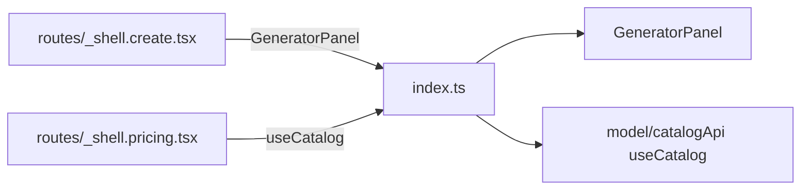

# index.ts — AI component doc

> AI-facing sidecar for `modules/Generator/index.ts`. Created 2026-07-06. Keep this in sync with the code on every change.

## Purpose

Public API of the Generator module — the single legal import point
(`import { GeneratorPanel, useCatalog } from 'modules/Generator'`).

## What it does (for an AI reader)

- Responsibilities: re-export the module's public surface; nothing else.
- Public API / exports: `GeneratorPanel`, `useCatalog`.
- Inputs → Outputs: import from `'modules/Generator'` → the panel component /
  the catalog query hook.
- Side effects: none.

## Dependencies

- Imports: `./components/GeneratorPanel`, `./model/catalogApi`.
- Used by: `routes/_shell.create.tsx` (GeneratorPanel),
  `routes/_shell.pricing.tsx` (useCatalog, Task 20).

## Diagram

## Key decisions / gotchas

- Deliberately minimal: the store and mutation stay module internals — routes
  must not reach the draft state directly, and the Gallery talks to the
  Generator only through the shared query cache (`['generations']`, `['me']`).
- `useCatalog` went public in Task 20 for the /pricing per-model table: both
  surfaces share the SAME `['catalog']` cache entry (staleTime Infinity), so
  exposing the hook beats duplicating the query in another module.

## Commits

- 2b7dd54 2026-07-06 feat(web): generator module — prompt, model/aspect/duration, i2v upload, cost
- a04eac7 2026-07-06 feat(web): pricing page with per-model credit table (exports `useCatalog`)
