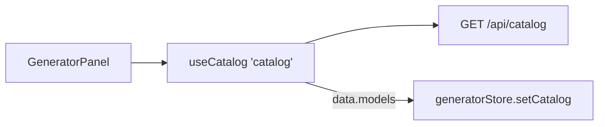

# catalogApi.ts — AI component doc

> AI-facing sidecar for `catalogApi.ts`. Created 2026-07-06. Keep this in sync with the code on every change.

## Purpose

TanStack Query hook for the curated model catalog — the Generator's single
source of models, aspect ratios, durations, and credit prices.

## What it does (for an AI reader)

- Responsibilities: fetch `GET /api/catalog` once per session; no UI, no store writes.
- Public API / exports: `useCatalog()` → `UseQueryResult<CatalogResponse>` on key
  `['catalog']` (staleTime `Infinity`); type `CatalogResponse = { models: CatalogModel[] }`.
- Inputs → Outputs: none → `{ models }` in the API's display order.
- Side effects: one GET via `shared/libs/apiClient`; populates the shared query cache.

## Dependencies

- Imports: `@tanstack/react-query`, `@opencreate/contracts` (`CatalogModel`), `shared/libs/apiClient`.
- Used by: `components/GeneratorPanel.tsx` (feeds `generatorStore.setCatalog`).

## Diagram

## Key decisions / gotchas

- `staleTime: Infinity` (plan Task 16): the catalog only changes with an API
  deploy — refetching mid-session would reorder model cards under the user.
- The response is trusted as typed by `@opencreate/contracts` (same trust
  boundary as every `api<T>()` call — decoded envelope errors only).

## Commits

- 2b7dd54 2026-07-06 feat(web): generator module — prompt, model/aspect/duration, i2v upload, cost
