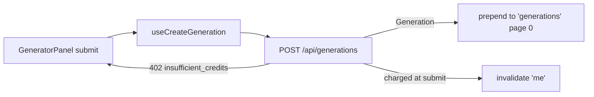

# createGeneration.ts — AI component doc

> AI-facing sidecar for `createGeneration.ts`. Created 2026-07-06. Keep this in sync with the code on every change.

## Purpose

TanStack mutation for `POST /api/generations` — submits the Generator draft and
feeds the result straight into the Gallery's list cache and the balance chip.

## What it does (for an AI reader)

- Responsibilities: submit `CreateGenerationInput`; on success update caches. No UI.
- Public API / exports: `useCreateGeneration()` → `UseMutationResult<Generation, ApiClientError, CreateGenerationInput>`.
- Inputs → Outputs: exact contracts payload → `Generation` DTO (image: `succeeded`/201;
  video: `processing`/202 that the Gallery polls).
- Side effects: POST via `shared/libs/apiClient`; prepends the DTO to the
  `['generations']` `InfiniteData<GenerationList>` cache (first page); invalidates `['me']`.

## Dependencies

- Imports: `@tanstack/react-query` (`useMutation`, `useQueryClient`, `InfiniteData`),
  `@opencreate/contracts`, `shared/libs/apiClient`.
- Used by: `components/GeneratorPanel.tsx` (submit + inline error branching on
  `ApiClientError.code === 'insufficient_credits'`).

## Diagram

## Key decisions / gotchas

- Writes into the Gallery-owned `['generations']` key WITHOUT importing the
  Gallery module — cross-module coupling goes through the shared query cache
  (same pattern as the `['me']` key shared by Auth/Credits).
- When the cache is empty/missing it seeds a one-page `InfiniteData` shape
  (`pageParams: [null]`) so a later `useInfiniteQuery` mount can extend it.
- No toast: the design-system kit (design.md §5) has no Toast surface — success
  feedback is the new card appearing in the adjacent gallery column.

## Commits

- (pending) feat(web): generator module — prompt, model/aspect/duration, i2v upload, cost
