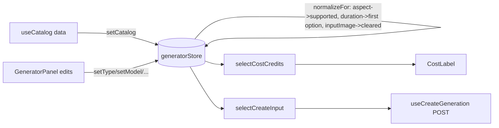

# generatorStore.ts — AI component doc

> AI-facing sidecar for `generatorStore.ts`. Created 2026-07-06. Keep this in sync with the code on every change.

## Purpose

Zustand store of the Generator module: holds the user's generation draft
(type, model, prompt, aspect ratio, duration, i2v image) and enforces the
normalization rules that keep the draft valid for the selected catalog model.

## What it does (for an AI reader)

- Responsibilities: draft state + normalization on model/type/catalog changes;
  pure selectors for price and the wire payload. No UI, no fetching.
- Public API / exports:
  - `useGeneratorStore` — Zustand hook; state `{ models, type, modelId, prompt, aspectRatio, duration, inputImage }`,
    actions `setCatalog/setType/setModel/setPrompt/setAspectRatio/setDuration/setInputImage`.
  - `selectModel(state)` → selected `CatalogModel | undefined`.
  - `selectCostCredits(state)` → `number | null` (image → flat `credits`; video → `creditsByDuration[String(duration)]`).
  - `selectCreateInput(state)` → exact `CreateGenerationInput | null` (null while no model or trimmed prompt < 2 chars).
- Inputs → Outputs: catalog models (from `catalogApi`) + user edits → a valid,
  submittable draft; optional fields (`duration`, `inputImage`) are OMITTED, not `undefined`.
- Side effects: none (pure client state).

## Dependencies

- Imports: `zustand`, `@opencreate/contracts` (`AspectRatio`, `CatalogModel`, `CreateGenerationInput`).
- Used by: `components/GeneratorPanel.tsx` (renders/edits the draft, submits `selectCreateInput`),
  `model/generatorStore.test.ts`.

## Diagram

## Key decisions / gotchas

- `normalizeFor` is the single place that re-validates a draft on model switch:
  unsupported aspect → model's first aspect; duration not offered → first
  `durationOptions` entry; `inputImage` cleared when `supportsImageInput` is false
  (plan Task 16 store contract, covered by tests).
- Pricing lives ONLY in the catalog models — the store never copies credit
  numbers, so an API catalog change propagates automatically.
- `selectCreateInput` trims the prompt and enforces the contracts 2-char minimum,
  so the submit button's disabled state and the wire payload can never disagree.
- Store is a module-level singleton; tests reset with
  `setState(getInitialState(), true)`.

## Commits

- 2b7dd54 2026-07-06 feat(web): generator module — prompt, model/aspect/duration, i2v upload, cost
