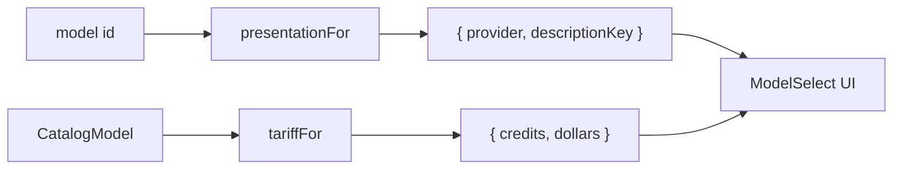

# modelPresentation.ts — AI component doc

> AI-facing sidecar for `modelPresentation.ts`. Created 2026-07-08. Keep this in sync with the code on every change.

## Purpose
Client-side PRESENTATION metadata for catalog models — which provider logo mark to draw, which i18n description key to read, and the display tariff (credits + $ equivalent). It is deliberately NOT part of the API contract: the API stays lean and honest, the web layer owns the marketing-facing extras.

## What it does (for an AI reader)
- Responsibilities: map a model id → `{ provider, descriptionKey }`; derive a display `{ credits, dollars }` tariff from a catalog model without duplicating pricing.
- Public API / exports / props / endpoints:
  - `type ProviderId` — the closed set of brand marks (`flux | pixverse | minimax | seedance | wan | kling | veo | generic`).
  - `type ModelPresentation = { provider; descriptionKey }`, `type ModelTariff = { credits; dollars }`.
  - `descriptionKeyFor(modelId): string` → `generator.models.<id>.description`.
  - `presentationFor(modelId): ModelPresentation` — provider (fallback `generic`) + description key.
  - `tariffFor(model: CatalogModel): ModelTariff` — image → flat `credits`; video → BASE-duration credits (`durationOptions[0]`); dollars = `credits × 0.01` to 2dp.
- Inputs → Outputs: a model id or `CatalogModel` → pure presentation values. No component state.
- Side effects (I/O, network, state): none — pure functions.

## Dependencies
- Imports / depends on: `CatalogModel` type from `@opencreate/contracts`.
- Used by: `ProviderMark.tsx` (provider glyph), `ModelSelect.tsx` / `ModelSelectOption.tsx` (tariff + description + logo).

## Diagram

## Key decisions / gotchas
- Pricing is never duplicated: `tariffFor` reads the credit numbers straight off the catalog model the API sent; only the `$0.01/credit` display equivalent is computed here.
- Video quotes its BASE (first) duration so every model shows one comparable number in the trigger and rows.
- Unknown/new model ids resolve to the `generic` mark instead of throwing — keeps the select renderable if the API adds a model before this map is updated.

## Commits
- _no commit yet_

## Key decisions (2026-07-09) — wan-runpod
- Added `'wan-2-2': 'wan'` to `PROVIDER_BY_MODEL` so the self-hosted "Forge" model draws the Wan brand mark. Description is `generator.models.wan-2-2.description` (EN/RU locales). Presentation only — the model itself comes from the server catalog and auto-renders in the video group.
