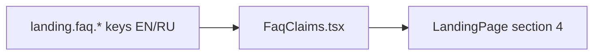

# FaqClaims.tsx — AI component doc

> AI-facing sidecar for `FaqClaims.tsx`. Created 2026-07-06, restyled
> 2026-07-07 (stage-2 editorial rows). Keep this in sync with the code on every change.

## Purpose
Landing section 04: the claims FAQ, restricted to the three honest topics the
plan's copy rules allow — credits never expire (+ no subscription required),
what a credit is, which models are behind the product. Clean hairline rows,
not boxy cards (brief: "FAQ as clean rows").

## What it does (for an AI reader)
- Responsibilities: `SectionHeading` (ordinal 04 + `landing.faq.title`) +
  `<ul>` of three hairline Q&A rows — serif h3 question (12-col span 5),
  ink-soft answer (span 7), baseline-aligned.
- Public API / exports: `FaqClaims` (no props).
- Inputs → Outputs: `ITEMS` const (`expire`/`credit`/`models`, doubling as
  i18n key segments `landing.faq.items.<id>.*`) → stacked hairline rows.
- Side effects: none.

## Dependencies
- Imports / depends on: `react-i18next`, `./SectionHeading`.
- Used by: `LandingPage.tsx` (section 04).

## Diagram

## Key decisions / gotchas
- Plain stacked Q&A instead of a disclosure/accordion — three short answers
  don't earn extra interaction cost (and stay findable with in-page search).
- The fourth approved claim («No subscription required») lives inside the
  `expire` answer — the FAQ must NOT grow topics beyond the approved claims.
- Rows have `border-b` only — SectionHeading draws the opening rule; the serif
  question/quiet answer contrast replaces the removed card chrome.

## Commits
- f2fe5d7 2026-07-06 feat(web): landing with honest price comparison (EN/RU)
- (pending) restyle(web): editorial landing + pricing
